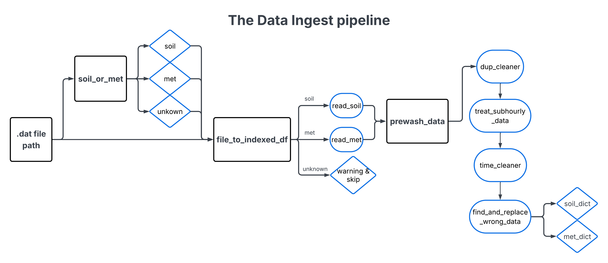

# TxSON Data Cleanup

Scripts and notebooks to ingest (read → prewash → clean) the raw TxSON network `.dat` files.

## Usage

Download the **`scripts/`** folder and work inside it — the modules import one another by name (e.g. `from read_data import ...`), so your working directory must be `scripts/`. Put your raw `TxSON_data_2026-02-24` folder of `.dat` files alongside `scripts/`, or pass its path on the command line.

Run the whole pipeline over a folder of raw files:

```bash
python get_data_dict.py <raw_data_folder> --prewash --download
```

Each step also runs standalone on a single file:

```bash
python <script>.py <input.dat> <output.csv>
```

for `dup_cleaner`, `treat_subhourly_data`, `time_cleaner`, `treat_wrong_data`, and `gap_report`. See **`scripts/demo.ipynb`** for a walkthrough of every script.

## Notebooks

- **DST_check** — checks whether the TxSON network observes daylight savings, and the data quirks found.
- **duplicate_check** — builds the tools that find all three duplicate cases; set the data path at the top and run all to regenerate the report (see `duplicate_report/README.md`).
- **data_visuals** — interactive Plotly explorer for the prewashed data; overlay variables and spot gaps (shown as red blocks).

## Folders

- **scripts** — read + prewash + clean the raw TxSON `.dat` files.
- **duplicate_report** — the dropped + kept rows for each of the three duplicate cases.
