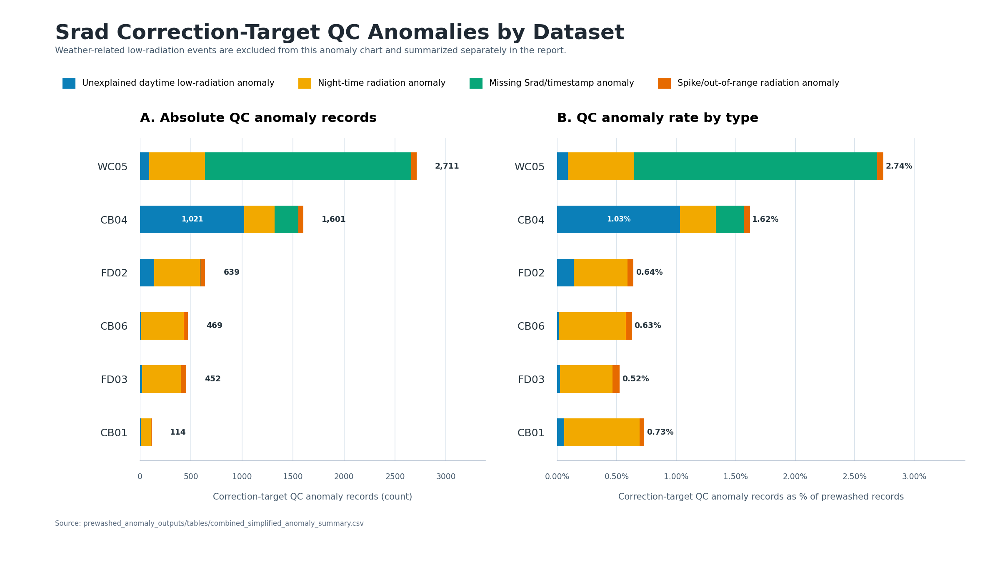

# Solar Radiation Anomaly Report

This document explains the output from running `generate_anomaly_report.py` on the six prewashed met-station solar radiation files. The prewashed files are already cleaned, standardized, de-duplicated, gap-filled in time, and ready for downstream quality control. The solar radiation variable evaluated here is `Srad`.

## What the code does

The routine marks and summarizes solar radiation QC anomalies in five passes. **The timestamps are a data column here**, and the code uses station latitude/longitude plus `America/Chicago` sunrise and sunset times to determine whether each record is daytime or night-time.

**Pass one - input parsing.** `load_prewashed_data()` reads the standardized prewashed CSV files, parses `Date`, coerces numeric weather columns, sorts records by time, and keeps the original observations.

**Pass two - data readiness check.** `data_health_row()` summarizes record counts, unique timestamps, duplicate rows, timestamp gaps, and missing `Srad` values. The current prewashed files have no duplicate timestamps and no hourly timestamp gaps.

**Pass three - daylight window.** `add_daylight_columns()` calculates sunrise and sunset for each station/date and adds a 30-minute buffer around the daylight window.

**Pass four - QC anomaly and weather-event marking.** `mark_anomalies()` marks correction-target QC anomalies separately from weather-related low-radiation events. Low `Srad` with precipitation in the current/recent hours or `RH >= 95%` is treated as a weather-related event, not as a value to automatically correct.

**Pass five - summary outputs.** The code writes row-level marked CSVs, detailed continuous-period tables, simplified station/category tables, the report, and the anomaly distribution figure.

---

## Anomaly statistics

Generated from the combined QC summary CSVs in this report. Weather-related low-radiation records are reported as advisory events and are **not** included in the correction-target anomaly distribution figure.

### Overall

- **Files scanned:** 6 prewashed met station files
- **Prewashed records across all files:** 474,127
- **Duplicate timestamp rows:** 0
- **Timestamp gap records:** 0
- **Missing `Srad` values:** 2,257
- **Correction-target QC anomaly records:** 5,986 (**1.26%** of prewashed records)
- **Weather-related low-radiation event records:** 13,508
- **All flagged records/events:** 19,494 (**4.11%** of prewashed records)
- **Continuous QC/event periods logged:** 9,756
- **Stations with at least one QC flag/event:** 6 of 6

### Major anomaly categories

| Category | Included detailed types | Records | % of flags/events | Stations affected | Treatment |
| --- | --- | --- | --- | --- | --- |
| Unexplained daytime low-radiation anomaly | Unexplained long daytime zero/near-zero run; Unexplained sudden radiation drop | 1,289 | 6.6% | 6 / 6 | Flag for review. Candidate for imputation only after sensor/weather review. |
| Night-time radiation anomaly | Night-time radiation anomaly | 2,198 | 11.3% | 6 / 6 | Flag for review. Candidate for setting to 0 or NA after confirmation. |
| Missing Srad/timestamp anomaly | Missing Srad value; Timestamp gap | 2,257 | 11.6% | 4 / 6 | Flag as missing. Candidate for solar-aware imputation after review. |
| Spike/out-of-range radiation anomaly | Sudden radiation spike; Out-of-range value | 242 | 1.2% | 6 / 6 | Flag for review. Candidate for replacement before imputation. |
| Weather-related low-radiation event | Weather-related low-radiation event | 13,508 | 69.3% | 6 / 6 | Advisory only. Retain by default because low Srad is weather-explained. |

### Detailed anomaly types

| Detailed type | Periods/runs | Records | Treatment |
| --- | --- | --- | --- |
| Weather-related low-radiation event | 6,600 | 13,508 | Advisory only; precipitation/recent precipitation or high RH explains low Srad. |
| Missing Srad value | 300 | 2,257 | Flagged as missing; candidate for imputation. |
| Night-time radiation anomaly | 2,190 | 2,198 | Flagged; no imputation applied. |
| Unexplained long daytime zero/near-zero run | 234 | 1,100 | Flagged as suspicious; candidate for review/imputation. |
| Sudden radiation spike | 242 | 242 | Flagged; candidate for replacement before imputation. |
| Unexplained sudden radiation drop | 190 | 190 | Flagged as suspicious; candidate for review/imputation. |

### Per-station

Stations are sorted by total flagged records/events. The `% records needing review` column counts only correction-target QC anomalies, excluding weather-related low-radiation events.

| Station | Prewashed rows | All flags/events | Correction-target QC anomalies | % records needing review | Unexplained low | Night-time | Missing Srad/gap | Spike/range | Weather event | First flag/event | Last flag/event |
| --- | --- | --- | --- | --- | --- | --- | --- | --- | --- | --- | --- |
| WC05 | 98,902 | 5,601 | 2,711 | 2.741% | 90 | 549 | 2,020 | 52 | 2,890 | 2014-11-13 19:00:00 | 2026-02-23 19:00:00 |
| CB04 | 98,907 | 4,691 | 1,601 | 1.619% | 1,021 | 298 | 232 | 50 | 3,090 | 2014-11-13 19:00:00 | 2026-02-22 19:00:00 |
| FD02 | 99,914 | 4,138 | 639 | 0.640% | 138 | 452 | 1 | 48 | 3,499 | 2014-10-03 07:00:00 | 2026-02-23 19:00:00 |
| CB06 | 74,596 | 2,358 | 469 | 0.629% | 11 | 419 | 4 | 35 | 1,889 | 2017-02-04 08:00:00 | 2025-08-02 19:00:00 |
| FD03 | 86,211 | 2,183 | 452 | 0.524% | 20 | 381 | 0 | 51 | 1,731 | 2016-04-27 07:00:00 | 2026-02-23 19:00:00 |
| CB01 | 15,597 | 523 | 114 | 0.731% | 9 | 99 | 0 | 6 | 409 | 2022-06-09 06:00:00 | 2024-03-18 07:00:00 |

### Imputation plan

No imputation is performed in this report. The script only marks QC anomalies and weather-related events so the original prewashed observations remain auditable.

| Anomaly class | Suggested imputation decision |
|---|---|
| Night-time radiation anomaly | If confirmed as sensor offset/noise, replace with 0 for radiation-balance workflows or set to NA for conservative analyses. Keep an imputation flag. |
| Missing Srad value or timestamp gap | For short gaps, use solar-aware interpolation constrained by hour-of-day and daylight/night status. For longer gaps, use seasonal/hourly climatology, nearby stations, or a model using `Rso`, `Tair`, `RH`, `Ppt`, and wind variables. |
| Spike/out-of-range radiation anomaly | Treat as invalid first, then impute using neighboring hours/stations or a clear-sky-constrained model. |
| Unexplained daytime low-radiation anomaly | Impute only after checking sensor context and nearby stations. |
| Weather-related low-radiation event | Do not impute by default; retain as a likely real cloudy/rainy/foggy condition. |

Safeguards for imputations:

- Preserve the original `Srad` column and write imputed values to a new column such as `Srad_imputed`.
- Add columns such as `Srad_imputed_flag` and `Srad_imputation_method`.
- Enforce physical bounds: `Srad_imputed >= 0` and a reasonable upper bound, such as the configured 1300 W/m^2 threshold or a clear-sky envelope after unit harmonization.
- Evaluate imputation quality by station, season, hour, and anomaly type before using the data in downstream analysis.

### Outputs generated

| Output | Path | Contents |
| --- | --- | --- |
| Marked prewashed data | prewashed_anomaly_outputs/marked_data/*_anomaly_marked.csv | Original columns plus Srad QC flags and weather-event labels |
| Station summaries | prewashed_anomaly_outputs/tables/*_simplified_anomaly_summary.csv | One row per station and major QC/event category |
| Combined simplified summary | prewashed_anomaly_outputs/tables/combined_simplified_anomaly_summary.csv | 30 rows |
| Combined detailed summary | prewashed_anomaly_outputs/tables/combined_detailed_anomaly_summary.csv | 9,756 continuous anomaly periods |
| Distribution figure | prewashed_anomaly_outputs/anomaly_distribution_by_dataset.png | Stacked correction-target QC anomaly count and rate chart |

### Anomaly Distribution

