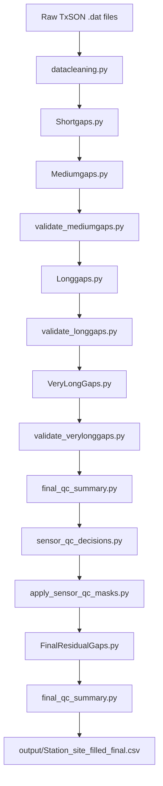

# TxSON 33-Station Soil Imputation Pipeline

## Zun Cao

This folder contains the soil moisture and soil temperature cleanup/imputation
workflow for the new TxSON 33-station dataset.

```text
datasets/TxSON_data_2026-02-24/
```

The current pipeline produces final filled soil outputs for:

```text
SWC_5, SWC_10, SWC_20, SWC_50
T_5, T_10, T_20, T_50
```

> MET variables such as `Ppt`, `Tair`, `RH`, `Srad`, `Wind speed`, and
> `Wind direction` still need separate filling/QC methods.

## Contents

- [Quick Links](#quick-links)
- [Setup](#setup)
- [Quick Start](#quick-start)
- [What To Open](#what-to-open)
- [Gap Filling Strategy](#gap-filling-strategy)
- [Pipeline Overview](#pipeline-overview)
- [Run Stages](#run-stages)
- [Stage Reference](#stage-reference)
- [Validation And QC](#validation-and-qc)
- [Known Data Notes](#known-data-notes)
- [Manual Debugging](#manual-debugging)
- [Detailed Notes](#detailed-notes)

## Quick Links

| Open | Description |
|---|---|
| [Open Dynamic Visualization Notebook](../../data_visualization/Dynamic_Data_Visualization_TxSON33.ipynb) | Interactive notebook for checking filled station data visually |
| [Open Technical Notes](TECHNICAL_NOTES_TxSON33.md) | Detailed implementation notes, validation counts, and known issues |
| [Open Visualization Script](../../data_visualization/txson33_dynamic_visualization.py) | Python source used by the dynamic visualization notebook |

## Setup

From the repository root:

```bash
python3 -m venv .venv
source .venv/bin/activate
pip install -r data-cleanup/imputation_pipeline/requirements.txt
```

Then run pipeline commands from this folder:

```bash
cd data-cleanup/imputation_pipeline
```

## Quick Start

Run the full soil workflow from raw `.dat` files to final QC:

```bash
python imputation_pipeline.py --stage all
```

Preview what would run without changing files:

```bash
python imputation_pipeline.py --stage all --dry-run
```

Run only final residual filling and final QC:

```bash
python imputation_pipeline.py --stage final
```

Run selected stations:

```bash
python imputation_pipeline.py --stage final --station CB01 FD08
```

The runner removes stale generated outputs for the selected stage range before
running. This prevents old downstream files, such as `filled_final.csv`, from
being accidentally reused by QC scripts.

Runtime note:

- `medium` is usually the slowest stage because it fits donor-based models for
  many station/parameter/depth gap segments.
- The full `all` pipeline can take a long time on a laptop, especially when
  rerunning all 33 stations from raw data.
- For testing or debugging, use `--dry-run`, run one stage at a time, or run a
  small station subset first, such as `--station CB01 FD08`.

## What To Open

| Need | Open |
|---|---|
| Final filled soil data | `output/Station{site}_filled_final.csv` |
| Final residual-fill detail log | `output/Station{site}_final_residual_fill_detail.csv` |
| Final QC summary | `final_qc_reports/final_qc_overview.csv` |
| Remaining NaN runs | `final_qc_reports/final_qc_remaining_nan_runs.csv` |
| Suspicious sensor summary | `final_qc_reports/final_qc_suspicious_sensors.csv` |
| Sensor QC decisions | `sensor_qc_reports/sensor_qc_decisions.csv` |
| Sensor QC mask log | `sensor_qc_reports/sensor_qc_masked_points.csv` |
| Dynamic visualization notebook | [Dynamic_Data_Visualization_TxSON33.ipynb](../../data_visualization/Dynamic_Data_Visualization_TxSON33.ipynb) |
| Detailed technical notes | [TECHNICAL_NOTES_TxSON33.md](TECHNICAL_NOTES_TxSON33.md) |

Current final soil status:

| Check | Result |
|---|---:|
| Final station files | 33/33 |
| Soil moisture/temperature NaN remaining | 0 |
| Physical bound violations | 0 |
| Known unavailable sensor columns | 12 |

## Gap Filling Strategy

| Gap Type | Gap Length | Current Method |
|---|---:|---|
| Short gaps | 1-24 hr | Local interpolation / nearest-neighbor style filling |
| Medium gaps | 24-168 hr | SARIMAX with optional exogenous variables, followed by validation repair |
| Long gaps | 168-720 hr | XGBoost rolling prediction, followed by validation repair |
| Very long gaps | >=720 hr | Cross-station donor linear regression with donor-mean fallback, followed by validation repair |
| Sensor-level anomalies | bad sensor periods | Mask suspicious sensor values, then refill with final donor-based residual filling |
| Final residual NaNs | remaining missing values | Linear donor, donor mean, or donor climatology fallback |

## Pipeline Overview



The individual scripts remain useful for debugging, but normal users should run
the workflow through `imputation_pipeline.py`.

## Run Stages

`imputation_pipeline.py` supports these stage groups:

| Stage | What It Runs |
|---|---|
| `all` | Full soil workflow from raw data to final QC |
| `soil` | Alias for `all` |
| `clean` | Raw `.dat` files to `cleaned_data/`, `missing_data/`, `raw_merged_data/` |
| `short` | Fill `<24h` gaps |
| `medium` | Medium gaps plus medium validation/repair |
| `long` | Long gaps plus long validation/repair |
| `verylong` | Very-long gaps plus very-long validation/repair |
| `qc` | Final QC before sensor masking, sensor decisions, sensor masks |
| `final` | Final residual filling plus final QC |

Examples:

```bash
python imputation_pipeline.py --stage medium
python imputation_pipeline.py --stage verylong --station CB01
python imputation_pipeline.py --stage all --param SWC_5 SWC_10
```

## Stage Reference

| Order | Script | Main Input | Main Output | Purpose |
|---:|---|---|---|---|
| 0 | `datacleaning.py` | Raw `.dat` files | `cleaned_data/`, `missing_data/`, `raw_merged_data/` | Parse files, merge soil/MET, enforce hourly timeline, summarize gaps |
| 1 | `Shortgaps.py` | `cleaned_data/` | `output/*_filled_shortgaps.csv` | Fill gaps shorter than 24 hours |
| 2 | `Mediumgaps.py` | short-gap outputs | `output/*_filled_mediumgaps.csv` | Fill 24-168 hour gaps with SARIMAX |
| 3 | `validate_mediumgaps.py` | medium outputs | `output/*_filled_mediumgaps_repaired.csv` | Reject suspicious medium fills |
| 4 | `Longgaps.py` | repaired medium outputs | `output/*_filled_longgaps.csv` | Fill 168-720 hour gaps with XGBoost |
| 5 | `validate_longgaps.py` | long outputs | `output/*_filled_longgaps_repaired.csv` | Reject suspicious long fills |
| 6 | `VeryLongGaps.py` | repaired long outputs | `output/*_filled_verylonggaps.csv` | Fill `>=720h` gaps using cross-station donors |
| 7 | `validate_verylonggaps.py` | very-long outputs | `output/*_filled_verylonggaps_repaired.csv` | Repair suspicious very-long fill points |
| 8 | `final_qc_summary.py` | latest staged output | `final_qc_reports/` | Summarize remaining NaNs and sensor issues |
| 9 | `sensor_qc_decisions.py` | final QC reports | `sensor_qc_reports/sensor_qc_decisions.csv` | Classify suspicious sensors |
| 10 | `apply_sensor_qc_masks.py` | sensor decisions | `output/*_filled_sensor_qc.csv` | Mask bad-sensor candidates |
| 11 | `FinalResidualGaps.py` | sensor-QC outputs | `output/*_filled_final.csv` | Fill remaining soil NaNs |
| 12 | `final_qc_summary.py` | final outputs | `final_qc_reports/` | Confirm final status |

## Validation And QC

Validation is intentionally staged:

| QC Layer | What It Catches |
|---|---|
| Medium validation | suspicious SARIMAX fills, boundary jumps, physical bounds |
| Long validation | suspicious XGBoost fills, boundary jumps, physical bounds |
| Very-long validation | bad points inside long donor-based fills, clipped values, large jumps |
| Final QC | remaining NaNs, missing sensor columns, low-variability sensors |
| Sensor QC | bad-sensor candidates such as near-zero/stuck sensors |
| Final residual filling | remaining NaNs after sensor QC |

Important report folders:

```text
final_qc_reports/
sensor_qc_reports/
```

The current final outputs have zero remaining NaNs for soil moisture and soil
temperature. However, some final values are lower confidence because they come
from full-column sensor replacement, not local station training. The method is
recorded in:

```text
output/Station{site}_final_residual_fill_detail.csv
```

## Known Data Notes

Some stations do not include all soil-depth columns in the source data. These
are unavailable sensors, not fillable gaps. The current stations missing
`SWC_50` and `T_50` are:

```text
CB07, CB26, FD03, FD18, FD21, FD24
```

Known bad-sensor candidates were masked before final residual filling. Examples
include:

```text
WC05 SWC_20, WC05 SWC_50
FD22 SWC_5, FD22 SWC_20, FD22 SWC_50
FD16 SWC_5
FD08 SWC_5
CB15 SWC_10
FD11 SWC_10
```

These values are not treated as valid observations in `*_filled_sensor_qc.csv`;
they are replaced during the final residual-fill stage and logged.

## Manual Debugging

Each script can still be run directly. This is useful when testing one station
or one parameter.

```bash
python Mediumgaps.py --station CB01 --param SWC_50
python validate_mediumgaps.py --station CB01 --param SWC_50 --write-repaired
python FinalResidualGaps.py --station WC05 --param SWC_20
```

When running scripts manually, make sure the previous stage output exists.
For normal use, prefer `imputation_pipeline.py`.

## Detailed Notes

Detailed implementation notes, validation counts, and the full development
record are in:

```text
TECHNICAL_NOTES_TxSON33.md
```
