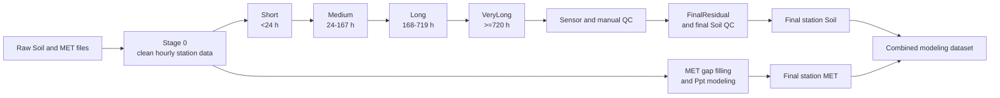

# TxSON 33-Station Cleanup and Imputation

## Zun Cao

This folder contains the data-cleaning, gap-filling, validation, and quality
control workflow used to prepare the TxSON 33-station dataset for modeling. It
reads the original Soil and MET `.dat` files, standardizes them to hourly time
series, fills supported gaps, applies reviewed QC decisions, and produces final
station-level and combined datasets.

## Contents

- [Final Dataset](#final-dataset)
- [Inputs](#inputs)
- [Pipeline](#pipeline)
- [Setup](#setup)
- [Running the Pipeline](#running-the-pipeline)
- [Stage Outputs](#stage-outputs)
- [Soil Processing](#soil-processing)
- [MET Processing](#met-processing)
- [Quality Control](#quality-control)
- [Visualization](#visualization)
- [Important Limitations](#important-limitations)

## Final Dataset

The complete Soil + MET modeling dataset is in:

```text
modeling_data/txson33_authoritative_2026-09-07/
```

Use this file for most downstream modeling:

```text
modeling_data/txson33_authoritative_2026-09-07/TxSON33_modeling.parquet
```

The dataset contains 33 stations and 2,720,775 hourly rows. A CSV version and
one CSV per station are included in the same directory. Supporting summaries
describe station date ranges, missingness, observed versus imputed values, and
column definitions:

```text
TxSON33_modeling.csv
data_dictionary.csv
station_summary.csv
missingness_summary.csv
observed_vs_imputed_summary.csv
imputation_provenance.csv
unresolved_qc_summary.csv
per_station/Station{site}_modeling.csv
```

Soil gaps inside each parameter's source coverage have been filled. Soil values
outside that coverage remain `NaN` by design, and source sensors that never
existed remain unavailable. `Ppt` is complete for all 33 stations. The other
MET variables are available only at the six stations with independent MET
records.

See the [modeling dataset README](../../modeling_data/txson33_authoritative_2026-09-07/README.md)
before beginning an analysis.

## Inputs

The default input directory is:

```text
datasets/TxSON_data_2026-02-24/
```

It contains 33 Soil files and six dedicated MET files. The parser supports both
the older numeric naming convention and the current site-code convention:

```text
SM_1.dat / MET_1.dat
CB01.dat / CB01_met.dat
```

It also handles citation text before a data header and Campbell TOA5 MET files.
Station IDs are kept as strings, so codes such as `CB01`, `FD08`, and `WC05`
remain intact.

## Pipeline



Stage 0 first resolves duplicate timestamps, then aggregates sub-hourly data
and builds the union of Soil and MET timestamp coverage. For stations with two
rainfall sources, valid dedicated-MET `Ppt` has priority and valid Soil-file
`Ppt` is the fallback.

Soil stages run in sequence and each one reads the output of its required
predecessor. Medium, Long, and VeryLong results pass through their validators
before the next stage begins.

## Setup

Python 3.11 is the tested version. From the repository root:

```bash
python3 -m venv .venv
source .venv/bin/activate
pip install -r data-cleanup/imputation_pipeline/requirements.txt
cd data-cleanup/imputation_pipeline
```

## Running the Pipeline

Preview the complete Soil workflow without running it:

```bash
python imputation_pipeline.py --stage all --dry-run
```

Run the complete Soil workflow, including Stage 0 and final QC:

```bash
python imputation_pipeline.py --stage all
```

Run the MET stages after Stage 0:

```bash
python imputation_pipeline.py --stage met
python imputation_pipeline.py --stage met-full
python imputation_pipeline.py --stage met-ppt
```

`all` and `soil` cover the Soil branch only. MET is kept separate so that a
MET rerun does not overwrite final Soil files.

Individual stages can be run for development checks:

```bash
python datacleaning.py --station CB04
python imputation_pipeline.py --stage medium --station CB01
python imputation_pipeline.py --stage long --station CB19 FD24 --param SWC_5 SWC_10
python imputation_pipeline.py --stage met-full --station CB04 --param Tair RH
```

Production QC stages (`all`, `soil`, `qc`, and `final`) run across the full
station cohort and all Soil parameters. For a scoped, read-only QC report, use
an explicit report directory:

```bash
python final_qc_summary.py --input-stage verylong-repaired --param SWC_5 \
  --report-dir targeted_qc_reports/swc5_before_sensor
```

The runner normally clears outputs downstream of the selected stage before it
starts. `--no-clean-stale` is available for a deliberate resume where completed
outputs have already been checked.

## Stage Outputs

| Stage | Main output |
|---|---|
| Stage 0 | `cleaned_data/Station{site}_cleaned_data.csv` |
| Stage 0 gap inventory | `missing_data/Station{site}_missing_data.csv` |
| Duplicate and source provenance | `duplicate_resolution_reports/`, `stage0_reports/` |
| Short | `output/Station{site}_filled_shortgaps.csv` |
| Medium + validation | `output/Station{site}_filled_mediumgaps_repaired.csv` |
| Long + validation | `output/Station{site}_filled_longgaps_repaired.csv` |
| VeryLong + validation | `output/Station{site}_filled_verylonggaps_repaired.csv` |
| Sensor QC | `output/Station{site}_filled_sensor_qc.csv` |
| Manual QC | `output/Station{site}_filled_manual_qc.csv` for affected stations |
| Final Soil | `output/Station{site}_filled_final.csv` |
| Final Soil QC | `final_qc_reports/` |
| Complete station MET | `met_output/Station{site}_met_filled_complete.csv` |
| Final modeling dataset | `modeling_data/txson33_authoritative_2026-09-07/` |

Each filling stage also writes long-form detail files for the values it creates.
The [technical notes](TECHNICAL_NOTES_TxSON33.md) list the complete file flow and
report set.

## Soil Processing

The Soil branch processes:

```text
SWC_5, SWC_10, SWC_20, SWC_50
T_5, T_10, T_20, T_50
```

| Gap length | Method |
|---|---|
| `<24 h` | PCHIP for soil moisture; time interpolation for soil temperature |
| `24-167 h` | SARIMAX with available complete environmental drivers |
| `168-719 h` | XGBoost |
| `>=720 h` | Cross-station donor regression with donor-mean fallback |

Coverage is defined separately for each Soil parameter, from its first to last
valid Stage 0 source observation. Only gaps inside that interval are eligible
for filling. This prevents MET-only boundary hours from being mistaken for
missing Soil measurements.

Medium models use a driver only when it is complete over the relevant training
and prediction windows. Missing `Ppt`, `Tair`, or `Srad` is never converted to a
physical zero; when no driver is usable, Medium uses its univariate SARIMA path.
Long models leave missing environmental features as `NaN` and use XGBoost's
native missing-value handling.

VeryLong selects one donor per station-parameter and uses that donor for all
VeryLong gaps in the series. It does not select a new donor for every gap.

Medium is the slowest Soil stage because SARIMAX order selection is repeated
across many gaps, and a serial run may take several days.

## MET Processing

Independent non-precipitation MET data are available at:

```text
CB01, CB04, CB06, FD02, FD03, WC05
```

For these stations, `MetGaps.py` fills internal gaps in `Tair`, `RH`, `Srad`,
`Wind speed`, and `Wind direction` using the parameter- and gap-specific method
map recorded in `met_qc_reports/met_selected_method_map.csv`. Gap runs are based
on true hourly timestamp adjacency.

Rainfall is handled separately:

1. Use valid dedicated-MET `Ppt` where available.
2. Otherwise use valid Soil-file `Ppt`.
3. If both sources are missing, use the two-part Random Forest model.

The model first estimates rain occurrence and then estimates positive rainfall
amount. It does not overwrite direct observations and does not reinterpret a
missing value as zero. The final dataset has no remaining `Ppt` gaps.

Stations without a dedicated MET file still receive final `Ppt`, but their
non-Ppt MET columns remain structurally unavailable.

## Quality Control

Stage 0 converts values outside the configured physical ranges to `NaN` and
reports them with missing timestamps. Medium, Long, and VeryLong each have a
separate validation and repair step.

Automatic whole-sensor detection creates review candidates only. A whole
sensor can be masked only by an `approved` row in
`sensor_qc_review_decisions.csv` containing the reviewer, review date, and
reason. The current decisions are:

```text
8 rejected whole-sensor masks
1 pending candidate: CB15 SWC_10
0 approved whole-sensor masks
```

Here, `rejected` means that whole-column masking was rejected; it does not mean
the sensor was certified as fault-free. The pending `CB15 SWC_10` candidate
remains unmasked and is reported in final QC.

Reviewed localized problems are stored in `manual_qc_masks.csv`. These masks
apply only to their exact inclusive intervals or timestamps. They run before
FinalResidual, and any requested refill method is confined to the approved
mask interval.

## Visualization

[Dynamic_Data_Visualization_TxSON33.ipynb](../../data_visualization/Dynamic_Data_Visualization_TxSON33.ipynb)
loads the final files from:

```text
modeling_data/txson33_authoritative_2026-09-07/per_station/
```

The notebook plots available Soil and MET variables by station and time period.
It reports structurally unavailable variables instead of substituting an
earlier pipeline file.

## Important Limitations

- `CB07`, `CB26`, `FD03`, `FD18`, `FD21`, and `FD24` have no source `SWC_50`
  or `T_50`. These 12 station-parameter combinations remain unfilled.
- The Stage 0 Soil/MET timestamp union adds boundary periods at several
  stations. The resulting 269,064 Soil `NaN` cells are outside parameter-specific
  source coverage and are intentionally retained.
- Non-Ppt MET variables are available only for the six stations with dedicated
  MET files and are not extrapolated beyond their retained coverage.
- `CB15 SWC_10` is still awaiting a whole-sensor review decision and remains
  unmasked.
- The model-comparison notebooks record method-development evidence. Their
  saved benchmark samples predate some final QC decisions; the completed
  modeling dataset, not those artificial-gap tables, is the data product to use.

Generated datasets and detailed reports are large and are not tracked in Git by default.
