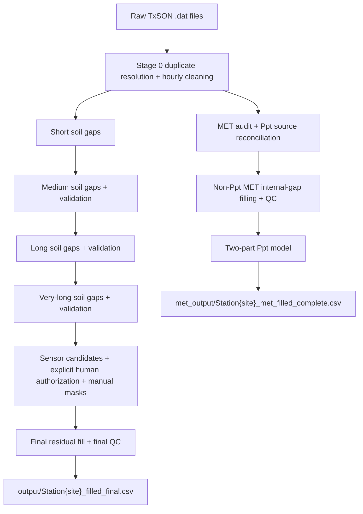

# TxSON 33-Station Cleanup and Imputation

## Zun Cao

This folder contains the reproducible cleanup, gap-filling, validation, and QC
workflow for the TxSON 33-station dataset. Soil and MET processing share the
same cleaned hourly input but write separate outputs.

## Contents

- [Current Status](#current-status)
- [Quick Links](#quick-links)
- [Setup](#setup)
- [Run the Pipeline](#run-the-pipeline)
- [Stage Names](#stage-names)
- [Pipeline Map](#pipeline-map)
- [Gap Methods](#gap-methods)
- [Ppt Source Policy](#ppt-source-policy)
- [Main Outputs](#main-outputs)
- [Soil Data Notes](#soil-data-notes)
- [Validation and Review](#validation-and-review)
- [Runtime](#runtime)
- [Publication Follow-up](#publication-follow-up)

## Current Status

| Part | Current status |
|---|---|
| Stage 0 cleaning | Rebuilt from all 39 raw Soil/MET files on 2026-09-06; 33 stations independently verified; 2,720,775 hourly rows |
| Soil moisture and soil temperature | 33 legacy final files exist; they have not been reverified under the new duplicate, source-coverage, sensor/manual-QC, and missing-driver rules |
| Soil QC | Eight whole-sensor masks rejected, one candidate pending, and 33 manual mask rows recorded; application to the new Stage 0 baseline awaits regeneration |
| Soil model comparison | Legacy benchmark retained the current method map; its saved results predate the corrected Stage 0 baseline and QC decisions |
| Non-Ppt MET | Legacy batch filled all internal gaps for the six dedicated-MET stations and reviewed 50/50 flags; regeneration is pending |
| MET model robustness | Legacy four-seed benchmark, independent confirmation, and deployment audit retained the current method map; regeneration is pending |
| Ppt | Stage 0 MET-first reconciliation is authoritative; the saved 33-station model-filled delivery with 0 NaNs is legacy and must be regenerated |

Under the current policy, non-Ppt MET values outside a station's retained
post-QC coverage are not extrapolated. The legacy Ppt review retained 10
low-confidence segments with caveats; optional external rainfall comparison
does not block regeneration.

Only Stage 0 has been regenerated. All downstream soil, MET, QC, final, and
benchmark counts above describe the preserved historical batch, not results
derived from the new baseline. Existing soil files also include the former
automatic candidate-masking behavior. Downstream regeneration is still required.

Stage 0 now covers the complete hourly union of Soil and MET source timestamps.
This preserves MET-only records within and outside Soil coverage. The shared
`soil_source_coverage.py` helper fixes each Soil parameter's coverage to its first
and last finite source-derived Stage 0 value, before any imputation or later QC.
All five Soil filling stages and their gap reports exclude timestamps outside
that interval. Missing/never-observed columns have no filling coverage. The
helper verifies the cleaned baseline against its Stage 0 SHA-256 manifest.

Before building that union, Stage 0 collapses exact duplicate rows, merges
nonconflicting complementary rows, and records conflicts while setting only the
conflicting values to NaN. It then aggregates each source hourly: precipitation
is summed, ordinary numeric measurements are averaged, and flags/metadata are
not numerically averaged. Each station manifest records source bounds and
SHA-256 hashes for raw inputs, Stage 0 code, and generated outputs.

The 33-station coverage check found 2,402,450 internal Soil NaN hours and
269,064 out-of-coverage Soil NaN hours; all internal gaps retain their original
lengths. Final QC reports the latter separately in
`final_qc_soil_source_coverage.csv`, not as failed residual gaps.
See the [coverage check](../../review_only/soil_source_coverage_2026-09-06/README.md).
No downstream production files have been regenerated yet.

See the [Stage 0 rebuild report](../../review_only/stage0_lineage_2026-09-06/README.md)
for the archived previous outputs, per-station differences, and all 33 verification results.

## Quick Links

| Open | Use |
|---|---|
| [Technical notes](TECHNICAL_NOTES_TxSON33.md) | Methods, validation counts, QC decisions, and limitations |
| [MET model comparison notebook](Gap_Filling_Model_Comparison.ipynb) | MET artificial-gap benchmark and error matrices |
| [MET robustness notebook](MET_Model_Robustness.ipynb) | Four-seed, seasonal, and station-level validation of non-Ppt MET methods |
| [Soil model comparison notebook](Soil_Gap_Filling_Model_Comparison.ipynb) | Soil artificial-gap benchmark and publication figure |
| [MET QC review notebook](MET_QC_Review.ipynb) | Review the 50 flagged MET segments and their decisions |
| [Dynamic visualization notebook](../../data_visualization/Dynamic_Data_Visualization_TxSON33.ipynb) | After regeneration, inspect paired final Soil + MET files by station, year, and parameter |

## Setup

Run from the repository root:

```bash
python3 -m venv .venv
source .venv/bin/activate
pip install -r data-cleanup/imputation_pipeline/requirements.txt
cd data-cleanup/imputation_pipeline
```

The default raw-data directory is:

```text
datasets/TxSON_data_2026-02-24/
```

Python 3.11 is the tested version.

## Run the Pipeline

To regenerate only one station's Stage 0, from this directory:

```bash
python datacleaning.py --station CB04
```

This writes only Stage 0 outputs and provenance. The commands below also run
downstream stages; they were not run as part of the Stage 0 baseline rebuild.

Preview a run first:

```bash
python imputation_pipeline.py --stage all --dry-run
```

Run the complete soil workflow:

```bash
python imputation_pipeline.py --stage all
```

Run the isolated MET stages in order:

```bash
python imputation_pipeline.py --stage met
python imputation_pipeline.py --stage met-full
python imputation_pipeline.py --stage met-ppt
```

`all` means the full soil workflow. MET is separate so a MET rerun cannot
overwrite final soil files.

Run a smaller target when testing:

```bash
python imputation_pipeline.py --stage medium --station CB01
python imputation_pipeline.py --stage long --station CB19 FD24 --param SWC_5 SWC_10
python imputation_pipeline.py --stage met-full --station CB04 --param Tair RH
```

`all`, `soil`, `qc`, and `final` are production QC routes and therefore reject
`--station` or `--param`. Use an isolated stage such as `medium`, `long`, or
`met-full` for write-based development tests. For a parameter-only read-only QC
diagnostic, use a separate report directory:

```bash
python final_qc_summary.py --input-stage verylong-repaired --param SWC_5 \
  --report-dir targeted_qc_reports/swc5_before_sensor
```

The runner removes stale downstream outputs for the selected stage. Use
`--no-clean-stale` only when deliberately preserving an earlier batch.
Every Soil stage requires its exact predecessor output, including each
validator's repaired file. Missing prerequisites cause a clear failure; no
stage silently substitutes an earlier, unvalidated file.

## Stage Names

| Stage | What it runs |
|---|---|
| `clean` | Parse raw files, resolve/report duplicate timestamps, aggregate sub-hourly records, build the hourly timeline, and flag invalid values |
| `short` | Fill soil gaps shorter than 24 hours |
| `medium` | Fill and validate 24-167 hour soil gaps |
| `long` | Fill and validate 168-719 hour soil gaps |
| `verylong` | Fill and validate soil gaps of 720 hours or longer |
| `qc` | Build QC reports, apply sensor decisions, and apply manual masks |
| `final` | Fill residual soil NaNs and run final QC |
| `all` / `soil` | Run every soil stage from `clean` through `final` |
| `met` | Reconcile Ppt sources, audit MET coverage, and fill short non-Ppt gaps |
| `met-full` | Apply MET sensor QC and fill all internal non-Ppt MET gaps within retained coverage |
| `met-ppt` | Fill Ppt hours missing from all approved direct sources |

## Pipeline Map



## Gap Methods

| Gap length | Soil method | Non-Ppt MET method |
|---|---|---|
| `<24 h` | PCHIP for SWC; time interpolation for soil temperature | Parameter-specific interpolation or benchmark winner |
| `24-167 h` | SARIMAX | Parameter-specific benchmark winner |
| `168-719 h` | XGBoost | Parameter-specific benchmark winner |
| `>=720 h` | Donor-station regression with donor-mean fallback | Parameter-specific benchmark winner |

Ppt is handled separately with a two-part Random Forest: rain occurrence is
classified first, then positive rainfall amount is estimated.

For Medium Soil gaps, a candidate driver is used only when it is complete over
both the seven-day training window and prediction interval. Incomplete drivers
are excluded; if none remain, the existing univariate SARIMA path is used.
Missing `Ppt`, `Tair`, or `Srad` is never converted to a physical zero, and the
selected driver mode, used/excluded drivers, and missing counts are logged.
Long-gap driver features likewise preserve missing environmental values as NaN;
they are not forward-filled, backward-filled, or zero-filled, and XGBoost
handles them through its native missing-value routing. Soil-temperature models
use independent `Tair` when it has observations and construct the existing
mean-soil-temperature proxy only when independent `Tair` is wholly unavailable.

Non-Ppt MET gaps are segmented by actual hourly timestamp adjacency. Missing
rows separated by more than one hour are never grouped merely because they are
adjacent in a filtered list of NaNs.

The saved expanded MET benchmark sampled five artificial gaps per station,
parameter, and gap class: 720 hidden gaps and 4,440 candidate-model fits.
Of those fits, 4,416 completed; 24 SARIMAX fits reported non-convergence and
were retained as explicit failures rather than used in a ranking. The only
production-map change supported by stable station-level evidence was short-gap
Wind direction, which now uses Random Forest and was confirmed with a second
random seed.

The follow-up non-Ppt MET robustness benchmark first excludes 33,142 confirmed
RH/Tair sensor-QC hours, then evaluates seeds 42, 7, 21, and 84. Tree-model
drivers use the reconciled direct-source Ppt series, following the approved
MET-first source policy. The benchmark contains 2,400 paired artificial gaps
and 13,920 standard-model results; 13,919 completed. A method is stable only
when the same winner leads at least 3/4 seeds, 3/4 seasons, and 4/6 stations.
Seven of 20 parameter-gap combinations confirm the current production method
and 12 unstable rankings retain the current method. XGBoost was the one stable
alternative for very-long Wind speed gaps, winning 4/4 seeds, 4/4 seasons, and
5/6 stations. In an independent seed-126 test it also passed all statistical
and QC gates for 720-1,440 hour gaps. The actual affected FD03 gap is much
longer at 12,368 hours, so a second seed-127 test hid one deployment-length
segment per station. XGBoost improved mean normalized RMSE by only 3.7% and
won 3/6 stations, failing the pre-defined 5% error and 4/6 station gates.
Donor regression therefore remains the production method, and no station file
was changed. A separate 96-case medium-gap SARIMAX screen completed but had
higher matched normalized RMSE than the best standard method for every tested
parameter.

The saved legacy deployment audit compared all 2,665 then-current internal
non-Ppt MET gaps (109,863 hours) with the benchmark lengths. Every medium and
long gap was inside the tested range. The 1,697 gaps below the benchmark
sampling minimum were only 1-5 hours, so they are shorter interpolation cases
rather than longer-horizon extrapolations. Eight very-long gaps exceeded the
1,440-hour benchmark maximum. Exact deployment-length tests compared the current method
with the strongest complete alternative at all eight over-range segment
lengths across Tair, RH, Srad, Wind speed, and Wind direction; all eight tests
retained the current method. Reports and the 300-DPI overview are in
`model_comparison_reports/met_robustness/deployment_coverage/`.

The saved soil benchmark used all 33 stations and 242 source-present sensor
columns after excluding 709,166 observed hours from the nine automatic sensor
candidates and the manual-QC periods. Those candidates were treated as
exclusions by the former workflow, not approved human decisions. Across seeds
42, 7, 21, and 84 the saved run evaluated 3,872 gaps and 19,424 model results;
19,340 completed. Of 32 parameter-gap rankings, 27 were stable in at least
three seeds and three seasons. Corrected benchmark code excludes only approved
whole-sensor decisions. The saved reports under `model_comparison_reports/soil/`
therefore remain historical. Eight whole-sensor masks have since been rejected
and one candidate remains pending, so the corrected exclusion set differs from
the former candidate set and the benchmark must be regenerated before it can be
treated as current.

A separate seed-126 confirmation then tested the 17 stable winners that differ
from the current production map. It used one paired artificial gap per season
for each candidate: 68 gaps and 136 current-versus-proposed fits, all
successful and with zero raw physical violations. Eleven changes passed the
error, season, physical-range, and boundary gates. Six retained the current
method: `SWC_5 medium`, `SWC_10 medium`, `T_10 short`, `T_20 short`, and
`T_50 medium` failed the independent error gate; `T_10 long` failed the
boundary gate.

The 11 candidates were then tested non-destructively through the exact
production functions and validator-aligned adoption checks. Five passed a shortest-
case smoke test and continued to an exact four-season trial. None passed the
complete adoption gate: four failed the exact matched-error/season rule, and
the `T_5 medium` comparison was incomplete because the current auto-SARIMAX
method exceeded the 180-second case limit in two seasons. The final production
method map therefore remains unchanged. These tests did not modify final
station CSV files.

## Ppt Source Policy

For the six stations with both soil-file and dedicated-MET rainfall:

1. Use valid dedicated-MET Ppt.
2. If MET Ppt is missing, use valid soil-file Ppt.
3. If both are missing, leave NaN for the Ppt model.
4. Never turn missing Ppt into zero before modeling.

For the other 27 stations, the soil-file Ppt is the observed source. This
policy was approved by the project lead in August 2026.

## Main Outputs

The paths below are the canonical output locations. Until the pending
downstream regeneration finishes, Soil, MET, QC, final, and benchmark files
already present at these paths are legacy artifacts rather than products of the
authoritative Stage 0 baseline.

| Output | Path |
|---|---|
| Final soil station data | `output/Station{site}_filled_final.csv` |
| Soil fill provenance | `output/Station{site}_final_residual_fill_detail.csv` |
| Final soil QC | `final_qc_reports/` |
| Soil QC decisions | `soil_qc_review_decisions.csv` |
| MET QC decisions | `met_qc_review_decisions.csv` |
| Short-gap MET data | `met_output/Station{site}_met_filled_shortgaps.csv` |
| Filled non-Ppt MET data | `met_output/Station{site}_met_filled_allgaps.csv` |
| Complete MET/Ppt delivery | `met_output/Station{site}_met_filled_complete.csv` |
| MET QC and provenance | `met_qc_reports/` |
| Current MET method map | `met_qc_reports/met_selected_method_map.csv` |
| MET robustness reports | `model_comparison_reports/met_robustness/` |
| Soil model comparison | `model_comparison_reports/soil/` |
| Soil robustness reports | `model_comparison_reports/soil/robustness/` |
| Soil independent confirmation | `model_comparison_reports/soil/targeted_confirmation/` |
| Soil exact production-adapter decision | `model_comparison_reports/soil/targeted_confirmation/production_adapter_four_season/` |

The dynamic notebook requires the exact final soil file and complete MET file
for every displayed station, then merges them by timestamp in memory. It fails
clearly when either final product is missing and never substitutes an earlier
stage. It does not create a third combined CSV or modify either delivery file.
Use it as a final-data review tool only after downstream regeneration. See the
[technical pipeline map](TECHNICAL_NOTES_TxSON33.md#current-pipeline-map) for
every intermediate output and report.

Generated station data and report folders can be large. Review them locally,
but do not add them to Git unless the project explicitly requests a release
artifact. Commit scripts, notebooks, documentation, and compact decision files.

## Soil Data Notes

The following source files do not contain `SWC_50` or `T_50`:

```text
CB07, CB26, FD03, FD18, FD21, FD24
```

These 12 station-parameter columns are unavailable sensors, not failed fills.
The pipeline skips them and does not invent full sensor histories.

In the legacy batch, final QC retained localized source-observed zero values at
CB27, FD03, and FD12. It also retained a source-observed CB15 `SWC_50` flat run.
Model-created zero fills at CB19 and FD24 were replaced with positive donor
support. These outcomes require confirmation in the regenerated batch.

## Validation and Review

- Medium, long, and very-long soil fills each pass a separate validator.
- Automatic sensor candidates never authorize masking. Whole-sensor masking
  requires an `approved` row in `sensor_qc_review_decisions.csv` with reviewer,
  review date, and reason.
- Candidate detection always reads the dedicated pre-sensor report under
  `sensor_qc_reports/before_sensor/`, not a later final-QC report.
- Eight current candidates have explicit `rejected` decisions and one,
  `CB15 SWC_10`, remains pending. The sensor-candidate workflow masks no whole
  column. Separately approved manual interval/point masks still apply. Here,
  `rejected` means reject whole-column masking; it does not certify the sensor
  as perfect.
- Approved sensor masks and manual interval masks run before final residual fill.
- Manual masks apply only to their inclusive approved start/end timestamps.
  A refill override is split at the mask boundary and cannot expand to the rest
  of a larger contiguous NaN run.
- The separate 89 segment/local soil review items have recorded closed decisions.
- In the legacy MET review, every flagged non-Ppt segment had a recorded
  decision: 50/50 closed.
- In the legacy Ppt review, every flagged segment had a recorded decision; 10
  retained an optional external-validation caveat.

Open the notebooks through the links above for visual review. The notebooks do
not change production CSV files.

## Runtime

The medium soil stage is usually the slowest because it fits many SARIMAX
models. A complete serial 33-station rerun can take several days and may approach
a week on the development laptop. Test one station first, then run the full batch
only after the targeted output looks correct.

The expanded MET model-comparison notebook took about 3 hours 48 minutes on the
development Mac. It is a research benchmark and is not required for a normal
production pipeline run.

The optimized four-seed non-Ppt MET robustness run took about 34 minutes,
including the 96-case SARIMAX screen. Version-matched cached reruns take about
five seconds. The two independent Wind speed confirmations each run in under a
minute. The complete deployment-coverage audit, including seven seed-128
exact-length comparisons and reuse of the Wind speed test, takes about four
minutes on the development Mac; cached reruns take seconds.

The initial soil seed takes roughly 3-4 minutes, and the complete four-seed
notebook takes about 10-12 minutes on the development Mac. Each seed limits
fixed-order univariate SARIMAX to 16 matched medium-gap cases; the production
medium stage remains much slower because it also uses optional drivers and
performs automatic order selection for many gaps. Cached reruns take seconds.
The independent seed-126 confirmation adds only 136 targeted fits and took
under one minute in the saved development run; its cached rerun also takes
seconds. The exact production-adapter smoke test took about 12 minutes and the
four-season trial about 14 minutes in the saved run. Cached notebook reruns
reuse their detail reports and take seconds.

## Publication Follow-up

Model development is complete, but a corrected production delivery still
requires authoritative downstream Soil and MET regeneration from the rebuilt
Stage 0 baseline. Eight whole-sensor masks are rejected; `CB15 SWC_10` remains
pending and will stay unmasked and explicitly reported unless a later human
decision changes it. Publication follow-up also includes:

- optionally investigate the five soil parameter-gap rankings that remain
  seasonally or seed unstable;
- separately profile or simplify production auto-SARIMAX if medium-stage
  runtime becomes a development priority;
- optionally compare the 10 low-confidence Ppt segments with an independent
  rainfall source after verified TxSON coordinates are available.

The saved four-seed MET robustness benchmark, independent Wind speed
confirmation, and deployment-gap coverage audit are complete as historical
method-selection evidence. Exact-length tests of all eight over-range segments
across five non-Ppt parameters retained the current MET production map.
The saved four-seed soil comparison is complete as a historical robustness
benchmark. Its 27
stable rankings produced 17 possible changes; 11 passed an independent
four-season confirmation, but none passed the complete exact-production
adoption sequence. The production soil method map remains unchanged. Existing
final CSV files are legacy artifacts and must be replaced by the pending
regeneration. The completed selection funnel, including rejected method
candidates, is the reproducible result to report rather than selecting from
proxy-model scores alone.
