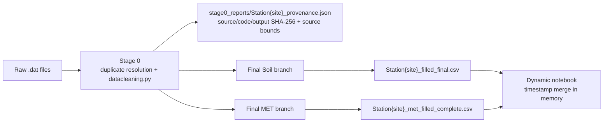
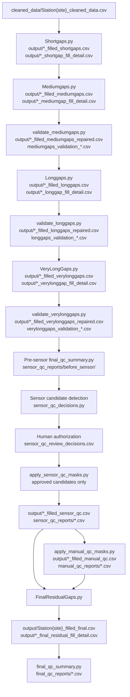
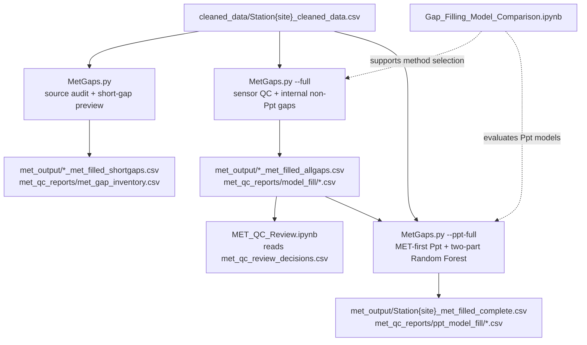

# TxSON 33-Station Technical Notes

## Zun Cao

This file records the implemented methods, existing batch results, and known
limits. Run instructions are kept in [README.md](README.md).

## Contents

- [Existing Generated Batch](#existing-generated-batch)
- [Current Pipeline Map](#current-pipeline-map)
- [Inputs and Stage 0](#inputs-and-stage-0)
- [Soil Source Coverage](#soil-source-coverage)
- [Gap Classes](#gap-classes)
- [Soil Filling](#soil-filling)
- [Soil Sensor and Manual QC](#soil-sensor-and-manual-qc)
- [Final Soil Fill and QC](#final-soil-fill-and-qc)
- [Missing Soil Sensors](#missing-soil-sensors)
- [Non-Ppt MET Filling](#non-ppt-met-filling)
- [Precipitation](#precipitation)
- [Model Comparison Notebooks](#model-comparison-notebooks)
- [Final Visualization](#final-visualization)
- [Provenance Files](#provenance-files)
- [Known Limits](#known-limits)

## Existing Generated Batch

The counts below describe the saved batch produced before the September 2026
duplicate-resolution and sensor-authorization corrections. That batch has not
been regenerated downstream. Stage 0 alone was rebuilt on 2026-09-06; its
current verification is documented under [Inputs and Stage 0](#inputs-and-stage-0).
The table below remains a historical snapshot, including its old review status.
In particular, its final soil files include nine automatic
whole-sensor candidate masks that the corrected workflow no longer authorizes.

| Check | Result |
|---|---:|
| Cleaned hourly station files | 33 |
| Final soil station files | 33 |
| Source-present soil parameter columns | 252 |
| Final soil rows | 2,685,804 |
| Final soil NaN hours | 0 |
| Final soil physical-bound violations | 0 |
| Missing source sensor columns | 12 |
| Segment/local soil QC decisions | 89 closed |
| Whole-sensor candidates | 9 pending, 0 approved, 0 rejected |
| Non-Ppt MET internal hours filled | 109,863 |
| Non-Ppt MET failed segments | 0 |
| Non-Ppt MET NaNs outside retained post-QC coverage | 473,355 |
| Non-Ppt MET review decisions | 50/50 |
| Ppt source-missing hours filled | 295,752 |
| Final Ppt NaN hours | 0 |
| Original Ppt observations changed by model | 0 |
| Non-Ppt MET QC observations excluded from robustness sampling | 33,142 |
| Non-Ppt MET robustness artificial gaps | 2,400 across four seeds |
| Successful non-Ppt MET standard-model results | 13,919 / 13,920 |
| Current MET methods confirmed across seed/season/station gates | 7 / 20 |
| Unstable MET rankings retaining current methods | 12 / 20 |
| MET alternative confirmation | 24 range cases plus 6 deployment-length cases; retained donor regression |
| Actual non-Ppt MET internal gaps audited | 2,665 segments / 109,863 hours |
| Short gaps below benchmark sampling minimum | 1,697 segments / 3,339 hours; all 1-5 hours |
| Very-long gaps above benchmark maximum | 8 segments / 72,268 hours |
| Exact deployment-length coverage decisions | 8 / 8 retained the current method across 5 parameters |
| MET production-method changes after robustness | 0 |
| MET matched SARIMAX screen | 96 / 96 successful; no parameter-level win |
| Soil artificial gaps evaluated | 3,872 across four seeds |
| Successful soil candidate results | 19,340 / 19,424 |
| Seed-and-season-stable soil rankings | 27 / 32 |
| Stable winners different from current soil map | 17 |
| Independent seed-126 confirmation | 68 gaps; 136/136 paired fits successful |
| Candidates entering exact production-adapter smoke test | 11 / 17 |
| Exact production-adapter smoke test | 22 fits; 19 completed, 3 timed out; 5 candidates advanced |
| Exact four-season production trial | 40 fits; 38 completed, 2 timed out |
| Verified soil production-method changes | 0 / 32; current map retained |

## Current Pipeline Map

### Overview



### Soil File Flow



Only stations listed in `manual_qc_masks.csv` receive a
`*_filled_manual_qc.csv`; all other stations go directly from sensor QC to the
final residual stage.

### MET File Flow



### File Index

| Stage | Main data, report, and decision files |
|---|---|
| Stage 0 | `cleaned_data/Station{site}_cleaned_data.csv`, `missing_data/Station{site}_missing_data.csv`, `raw_merged_data/raw_merged_station_{site}.csv`, `duplicate_resolution_reports/Station{site}_duplicate_{summary,conflicts}.csv`, `stage0_reports/Station{site}_provenance.json` |
| Medium validation | `mediumgaps_validation_summary.csv`, `mediumgaps_rejected_segments.csv`, `mediumgaps_validation_station_summary.csv` |
| Long validation | `longgaps_validation_summary.csv`, `longgaps_rejected_segments.csv`, `longgaps_validation_station_summary.csv` |
| Very-long validation | `verylonggaps_validation_summary.csv`, `verylonggaps_review_segments.csv`, `verylonggaps_repaired_points.csv`, `verylonggaps_validation_station_summary.csv` |
| Sensor/manual QC | `sensor_qc_reports/before_sensor/*.csv`, `sensor_qc_reports/*.csv`, `sensor_qc_review_decisions.csv`, `manual_qc_reports/*.csv`, `manual_qc_masks.csv` |
| Final soil QC | `final_qc_reports/{final_qc_overview.csv, final_qc_station_parameter_summary.csv, final_qc_missing_sensor_columns.csv, final_qc_suspicious_sensors.csv, final_qc_review_closure_summary.csv}` |
| MET audit/fill | `met_qc_reports/met_station_parameter_summary.csv`, `met_gap_inventory.csv`, `met_selected_method_map.csv`, `model_fill/*.csv`, `ppt_model_fill/*.csv` |
| Model comparison | `model_comparison_reports/` for MET; `model_comparison_reports/soil/` for soil |
| Compact decisions | `soil_qc_review_decisions.csv`, `met_qc_review_decisions.csv` |

`imputation_pipeline.py` is the entry point. Soil and MET write separate files,
so a MET rerun cannot overwrite final soil output. The dynamic notebook merges
the two final files only in memory and does not create another delivery CSV.

## Inputs and Stage 0

Raw files are read from:

```text
datasets/TxSON_data_2026-02-24/
```

`datacleaning.py` supports both naming schemes:

```text
SM_1.dat / MET_1.dat
CB01.dat / CB01_met.dat
```

It also handles citation text before a CSV header and Campbell TOA5 MET files.
Station IDs are strings, so numeric IDs and codes such as `CB01` or `FD08`
follow the same path.

Stage 0 does the following:

- classifies duplicate timestamps before hourly aggregation;
- collapses exact duplicates and merges complementary rows column-wise;
- sets conflicting measurements to NaN and records every source row involved;
- reports Flag-only conflicts and sets the ambiguous Flag to NaN because the
  repository does not document a severity or bit ordering;
- aggregates each duplicate-resolved source to hourly data before merging;
- rejects nonfinite/negative source Ppt before summing, so an invalid sample
  cannot cancel valid sub-hourly rain or block the valid alternate source;
- sums Ppt within an hour, averages numeric measurements, and keeps the final
  Flag or other metadata value rather than averaging a QC flag;
- outer-merges Soil and MET and creates the complete hourly index over their
  combined start/end bounds, preserving every MET-only hour;
- selects valid MET Ppt first, then valid Soil Ppt, leaving NaN only if neither
  source supplies valid precipitation;
- converts invalid measurements to NaN;
- writes cleaned data, a matching gap inventory, duplicate reports, and a
  manifest with source coverage plus raw input/code/output hashes.

`raw_merged_data` is an hourly source-resolved intermediate, not a byte-for-byte
raw archive. It already includes duplicate resolution, Ppt validity/source
selection, and timestamp completion; the original `.dat` files remain unchanged.
Other physical-range checks occur when producing `cleaned_data`.

Physical checks are:

| Parameter | Allowed range |
|---|---:|
| `SWC_*` | 0 to 0.6 m3/m3 |
| `T_*`, `Tair` | -30 to 60 C |
| `RH` | 0 to 100% |
| `Ppt`, `Srad` | >=0 |
| `Wind speed` | 0 to 25 m/s |
| `Wind direction` | 0 to 360 degrees |

Main Stage 0 outputs:

```text
cleaned_data/Station{site}_cleaned_data.csv
missing_data/Station{site}_missing_data.csv
raw_merged_data/raw_merged_station_{site}.csv
duplicate_resolution_reports/Station{site}_duplicate_summary.csv
duplicate_resolution_reports/Station{site}_duplicate_conflicts.csv
stage0_reports/Station{site}_provenance.json
```

A read-only scan of the current 39 raw files found 94,976 duplicate timestamp
groups: 94,873 exact groups, no complementary groups, 63 measurement-conflict
groups, and 40 Flag-only conflict groups. The production resolver records these
counts per station/source. Every stage after Stage 0 now treats any remaining
duplicate timestamp as an invariant violation instead of choosing a first or
last row.

### Authoritative baseline rebuilt 2026-09-06

The 33 stations have now been regenerated with this implementation. An
independent vectorized reference parsed the 39 original files, resolved their
duplicate cells, aggregated hourly values, applied source priority and physical
ranges, and matched every regenerated raw/cleaned value. All 33 indexes are
unique, monotonic, hourly, and cover the raw-source union. Every missing-summary
interval exactly matches the cleaned NaNs. There were no invalid raw dates.

The old implementation/output lineage mixed Soil-only merges with later MET
reconciliation. Even the pre-fix code still clipped MET to Soil bounds.
The new baseline restores 13,578 Ppt observations inside the previous coverage
and 33,959 outside it, preserving 47,537 MET-only hours in total. Two previous
Ppt values (FD22 and FD29) become NaN because their raw duplicates conflict.

| Station | Previous cleaned rows | New cleaned rows | Restored internal Ppt hours | Added valid Ppt hours outside old bounds |
|---|---:|---:|---:|---:|
| CB04 | 94,562 | 99,914 | 1,206 | 5,352 |
| CB06 | 93,580 | 94,037 | 0 | 457 |
| FD02 | 93,605 | 99,914 | 2 | 6,309 |
| FD03 | 82,631 | 87,983 | 12,368 | 5,352 |
| WC05 | 82,458 | 99,959 | 2 | 16,489 |

Total cleaned rows increase from 2,685,804 to 2,720,775. WC05 gains 17,501
timeline rows, including 1,012 hours with no MET source record. Twenty-nine
stations change in values or coverage; FD17, FD21, FD23, and FD28 retain identical
cleaned values and coverage. Duplicate processing collapses 178,546 excess rows
and reports all 63 measurement-conflict and 40 Flag-only conflict groups.
No duplicate policy or downstream model methodology changed during this rebuild.

Full per-parameter differences, source counts, 33-station checks, and the old
99-file archive are in the [Stage 0 rebuild package](../../review_only/stage0_lineage_2026-09-06/README.md).
Downstream and benchmark files were preserved and must be regenerated before
being attributed to this baseline. In particular, added MET-only boundary hours
create structural Soil NaNs, whose source coverage is explicitly recorded in
each provenance manifest. The shared coverage mechanism below now enforces
parameter-level observational support during Soil filling and gap reporting.

## Soil Source Coverage

`soil_source_coverage.py` is the single coverage definition for Short, Medium,
Long, VeryLong, FinalResidual, the three validators, and final QC reports.
For each Soil parameter, coverage is the closed hourly interval between its
first and last finite value in the hash-verified Stage 0 cleaned baseline.
These are source observations after duplicate/hourly/range cleaning, before
any imputation or sensor/manual masks. No imputed or post-QC values define or
extend coverage; masking the whole supported interval does not erase coverage.

This is an observational-support rule, not a claim to know installation dates.
The raw files have fixed sensor columns but no explicit per-sensor deployment
calendar. Direct inspection of all 33 Soil sources, using Stage 0 hourly
alignment, found that all 252 present sensor columns share their station's
Soil start/end. The other 12 columns are absent. There are no present columns
with zero finite source support in this dataset. A parameter-level rule also
protects later-starting, earlier-ending, or entirely empty sensors in other
inputs without incorrectly borrowing a neighboring sensor's coverage.

The original `missing_data` files remain complete inventories of all NaNs.
Before assigning a Soil gap class, every loader/validator intersects those
intervals with source coverage and recalculates their lengths. Internal gaps
remain eligible, including long internal outages. FinalResidual scans only
eligible NaNs before applying any manual refill override or donor fallback.
Stage output checks reject nonmissing values outside coverage; donor cohorts
are checked before VeryLong/FinalResidual write any station. Donor ranking,
regression, fallback methods, and gap-length thresholds are unchanged.

Final QC's `NaN Hours`, gap classes, and residual totals describe internal
missing data. `Outside Source Coverage NaN Hours` is recorded separately,
with source bounds/status and the baseline hash, in the parameter summary and
`final_qc_soil_source_coverage.csv`. Absent columns are listed without inventing
values or counting a nonexistent column as a failed residual gap. Coverage
provenance remains recoverable from the fixed baseline and its manifest at
every intermediate stage.

The read-only 33-station inventory found **2,402,450 internal** and **269,064
outside-coverage** Soil NaN cells (station-parameter-hours). All outside hours
are excluded from all five stages and all original internal gap intervals and
lengths are unchanged. Protected outside hours are CB04 42,816; CB06 3,656;
FD02 50,472; FD03 32,112; WC05 140,008. Absent source columns are counted
separately and are not part of those NaN-cell totals.

See the [coverage verification package](../../review_only/soil_source_coverage_2026-09-06/README.md)
for per-parameter provenance, stage eligibility checks, and three real
in-memory short-gap interpolation samples. The 52 targeted/existing tests pass;
no downstream production outputs were regenerated during this coverage pass.

## Gap Classes

The code uses non-overlapping boundaries everywhere:

| Class | Number of missing hours |
|---|---:|
| Short | `<24` |
| Medium | `24-167` |
| Long | `168-719` |
| Very long | `>=720` |

## Soil Filling

The soil pipeline covers:

```text
SWC_5, SWC_10, SWC_20, SWC_50
T_5, T_10, T_20, T_50
```

### Short gaps

`Shortgaps.py` uses bracketed PCHIP for soil moisture and bracketed time
interpolation for soil temperature. A gap is filled only when observations
exist on both sides; edge extrapolation is not used.

### Medium gaps

`Mediumgaps.py` fits SARIMAX models with local context and optional available
drivers. Soil moisture can use Ppt; soil temperature can use Tair or Srad. The
validator checks missing predictions, physical bounds, and boundary jumps.

Full validation result:

```text
accepted: 877 segments
rejected:  50 segments
skipped:   97 segments
```

Rejected fills are restored to NaN before the next stage.

### Long gaps

`Longgaps.py` uses rolling XGBoost predictions with time features, target
history, and available environmental drivers. The validator applies the same
basic completeness, bounds, and connection checks.

Full validation result:

```text
accepted: 257 segments
rejected:   1 segment
```

### Very-long gaps

`VeryLongGaps.py` selects a correlated donor station, fits a linear mapping
when target/donor overlap is sufficient, and falls back to a donor mean. The
validator repairs bad points instead of rejecting an otherwise useful
months-long or years-long segment.

Initial validation result:

```text
accepted: 163 segments
review:    82 segments
repaired:  18 segments
points restored to NaN: 56,948
```

The 82 `review` labels remain in the original validation CSV for traceability.
All 82 now have closed decisions in `soil_qc_review_decisions.csv`:

```text
accepted with donor-mean caveat:             63
accepted event-supported non-severe jumps:   13
accepted with low cross-depth agreement:      3
accepted with donor-event caveat:              2
repaired isolated model jump:                  1
```

## Soil Sensor and Manual QC

Automatic sensor QC detects measurements that may represent bad sensors rather
than ordinary gaps. Detection creates candidates only. The current candidates
are:

```text
WC05 SWC_20, SWC_50
FD22 SWC_5, SWC_20, SWC_50
FD16 SWC_5
FD08 SWC_5
CB15 SWC_10
FD11 SWC_10
```

All nine candidates are pending. `sensor_qc_review_decisions.csv` currently has
no approved or rejected rows, so the corrected workflow masks none of them.
Whole-sensor approval requires station, parameter, `approved` or `rejected`,
reviewer, review date, and reason. The generated candidate table and final QC
both report unresolved candidates.

Candidate detection consumes the dedicated very-long-repaired audit in
`sensor_qc_reports/before_sensor/`. Later post-QC and final reports cannot
overwrite this input or change the candidate cohort on a standalone rerun.

The earlier generated batch automatically masked 766,651 values from these nine
columns. That number is retained only as legacy provenance; it is not an
authorized result under the corrected workflow.

`manual_qc_masks.csv` records visual decisions that cannot be expressed as a
general sensor rule:

```text
CB15 SWC_5: full sensor
CB15 T_10: one isolated model jump at 2019-12-03 13:00
CB19 SWC_5 and SWC_10: 2019-07 through 2022-10
CB20 SWC_5: 2017-01 through 2022-11
CB20 SWC_50: 2017-01 through 2023-03, donor-mean override
```

Manual masks cover 200,994 values across three stations.

## Final Soil Fill and QC

`FinalResidualGaps.py` fills NaNs left by validation and sensor masking in this
order:

1. linear donor regression when enough target/donor overlap exists;
2. donor mean where the selected donor is missing;
3. donor mean without target training for a fully masked sensor;
4. donor day-of-year/hour climatology when no same-hour donor exists.

For model-created SWC predictions clipped to exactly zero, a positive donor
mean or climatology is used instead. This does not alter source observations.

Current fill-detail counts:

```text
donor_mean_no_target_training:           859,660
linear_donor:                            115,619
donor_mean_manual_override:               54,162
donor_mean_missing_linear_donor:           4,378
donor_mean_lower_bound_repair:               142
donor_climatology_no_timestamp_donor:        748
total:                                  1,034,709
```

The seven final sensor flags and the related very-long review led to these
actions:

- 142 model-created SWC zero fills at CB19 and FD24 were replaced;
- one isolated CB15 `T_10` jump was replaced through the separate very-long
  review;
- 133 localized zero values at CB27, FD03, and FD12 were retained because they
  exist in the cleaned source;
- the 898-hour CB15 `SWC_50` flat run was retained because it is source data
  and the full sensor is not flat or near-zero dominated.

Together with the 82 very-long decisions, the segment/local soil decision table
contains 89 closed items. This count is separate from the nine unresolved
whole-sensor candidates. Final QC reports both categories rather than treating
the candidates as closed decisions.

Final QC outputs:

```text
final_qc_reports/final_qc_overview.csv
final_qc_reports/final_qc_station_parameter_summary.csv
final_qc_reports/final_qc_missing_sensor_columns.csv
final_qc_reports/final_qc_suspicious_sensors.csv
final_qc_reports/final_qc_sensor_candidate_status.csv
final_qc_reports/final_qc_review_closure_summary.csv
soil_qc_review_decisions.csv
```

## Missing Soil Sensors

These stations do not contain `SWC_50` or `T_50` in the source:

```text
CB07, CB26, FD03, FD18, FD21, FD24
```

The pipeline skips these 12 absent station-parameter columns. They are not
counted as residual NaNs and are not synthesized.

## Non-Ppt MET Filling

Dedicated non-Ppt MET observations are available at:

```text
CB01, CB04, CB06, FD02, FD03, WC05
```

The MET workflow is isolated in `MetGaps.py`. It fills internal gaps only;
leading or trailing periods outside retained post-QC coverage remain NaN.
Sensor QC targets confirmed Tair and RH faults before model filling. Coverage
is recalculated after those masks, so a rejected endpoint is not extrapolated.
For example, the final CB04 Tair point at `2024-05-27 16:00` was masked because
55.28 C disagreed strongly with concurrent network support (median 37.97 C). It
is the trailing edge after QC and intentionally remains NaN rather than being
reported as a failed internal fill.

The expanded five-gap artificial-gap benchmark selected this production map:

| Parameter | Short | Medium | Long | Very long |
|---|---|---|---|---|
| Tair | Donor regression | Donor regression | Donor regression | Donor regression |
| RH | Linear | XGBoost | Donor regression | Donor regression |
| Srad | Donor regression | Random Forest | XGBoost | Donor regression |
| Wind speed | XGBoost | XGBoost | XGBoost | Donor regression |
| Wind direction | Random Forest | Random Forest | Random Forest | XGBoost |

Current batch result:

```text
internal hours filled: 109,863
failed segments: 0
automated screening flags: 50
accepted decisions: 45
accepted-with-caveat decisions: 5
```

The current delivery combines the original full-parameter batch with the
benchmark-driven Wind direction rerun. That rerun changed only missing Wind
direction values; all direct observations, Ppt, and other MET columns were
unchanged. Its 15 Wind direction flags replace 13 flags from the earlier model,
giving 50 current decisions. The five caveats are method-confidence notes, not
open data failures. Original screening statuses remain unchanged so the
decision layer can be audited. Use `met_qc_reports/met_selected_method_map.csv`
as the canonical current map; the copy under `model_fill/` records the earlier
full batch before the targeted Wind direction update.

## Precipitation

### Source reconciliation

Six stations contain Ppt in both soil and dedicated-MET files. On overlapping
valid hours:

```text
different values: 19,235 hours
wet/dry disagreement: 10,054 hours
additional direct-source hours recovered: 13,578
```

The approved source order is:

1. valid dedicated-MET Ppt;
2. valid same-station soil-file Ppt when MET is missing;
3. NaN when both are missing;
4. the Ppt model only after reconciliation.

The model never overwrites a retained direct observation.

### Ppt model

Missing Ppt is modeled in two parts. A Random Forest first estimates rain
occurrence; a second Random Forest estimates positive amount. Features use
hour/day-of-year cycles and robust concurrent donor-network aggregates. The
rain threshold is chosen per station from out-of-bag predictions by CSI, with
0.5 as fallback.

Current 33-station result:

```text
source-missing hours filled: 295,752
predicted wet hours:           7,482
predicted Ppt total:          13,408.513
remaining Ppt NaNs:                    0
direct observations changed:           0
failed segments:                       0
```

All 104 screening flags have decisions:

```text
accepted for current pipeline:                 46
accepted with no-concurrent-donor caveat:      46
accepted with spatial-disagreement caveat:      2
optional external comparison:                  10
```

The 10 external comparisons are optional. Their current model values remain in
the delivery files. Independent checking would first require a verified
latitude/longitude table for the 33 station codes, which is not present in the
repository.

## Model Comparison Notebooks

### MET benchmark

`Gap_Filling_Model_Comparison.ipynb` hides complete observed segments and
scores each model against the hidden truth. The current saved run uses:

```text
six MET stations
six MET parameters
four gap classes
five sampled gaps per station and class
720 artificial gaps sampled in total
4,416 successful candidate fits out of 4,440
```

It reports MAE, RMSE, bias, runtime, boundary behavior, physical violations,
wind-direction angular error, and Ppt event/amount metrics. All 720 hidden gaps
were evaluated successfully by at least one candidate. The 24 failed fits were
SARIMAX non-convergence cases and remain visible in the detail report. The full
notebook took about 3 hours 48 minutes on the development Mac.

The saved Ppt run uses the same robust donor aggregates and OOB-CSI threshold
as production. Two-part Random Forest has the lowest mean Ppt MAE and daily
total MAE in all four saved gap classes. Short-gap Wind direction was the only
production-map change supported by stable station-level evidence: Random Forest
beat XGBoost in the five-gap run and again in a second-seed six-station check.

The original notebook records the expanded single-seed comparison and Ppt
experiment. Its non-Ppt rankings are followed by the multi-seed validation
below rather than treated as final paper results on their own.

#### Non-Ppt MET robustness

`MET_Model_Robustness.ipynb` and `met_model_robustness.py` perform the completed
follow-up validation without modifying production files. Before sampling,
they remove the 33,142 observed RH/Tair hours listed in
`met_qc_reports/model_fill/met_sensor_qc_masked_segments.csv`. Tree-model
drivers use the reconciled direct-source Ppt series from `met_output/`, which
follows the approved MET-first policy and then uses soil-file Ppt when the
dedicated MET source is missing. Four seeds (`42`, `7`, `21`, and `84`) each
hide five non-overlapping, bracketed observed segments for every station,
parameter, and gap class. This produces 2,400 artificial gaps across the six
dedicated-MET stations.

The standard comparison includes linear interpolation, monthly-hour
climatology, donor regression, Random Forest, HistGradientBoosting, and
XGBoost. Wind direction omits linear donor regression and uses circular
prediction and error. Tree candidates are trained once per station, parameter,
and seed for all hidden segments, matching the production batch pattern. Of
13,920 paired results, 13,919 completed. The one explicit failure is an FD02
Srad long-gap donor prediction with 12 unsupported hours after the production
sparse-hole fallback.

Ranking uses normalized RMSE after the same physical-range clipping used by
production. Raw physical excursions, boundary screens, and failures remain
separate QC fields; they are not silently discarded. A winner is stable only
when the same method wins at least three of four seeds, three of four seasons,
and four of six stations. The result is:

```text
current production method confirmed:                 7 / 20
unstable ranking; retain current method:             12 / 20
stable alternative requiring targeted confirmation:  1 / 20
production methods changed:                           0 / 20
```

The one alternative is XGBoost for very-long Wind speed gaps. It wins 4/4
seeds, 4/4 seasons, and 5/6 stations, while the current method is donor
regression. Its raw physical-excursion rate is also much lower in these tests.

Independent confirmation uses gates fixed before fitting: at least 5% lower
mean normalized RMSE, wins in at least three of four seasons and four of six
stations, a majority of paired cases, raw physical-excursion rate no higher
than the current method and no greater than 0.1%, and no boundary screen. Seed
126 hides one 720-1,440 hour gap per season and station. XGBoost passes these
statistical and QC gates with 7.3% lower normalized RMSE, 4/4 seasonal wins,
5/6 station wins, and 15/24 paired-case wins.

That range does not cover the only actual very-long Wind speed deployment gap:
FD03 has 12,368 missing hours from 2021-02-12 05:00 through 2022-07-12 12:00.
A second independent seed (`127`) therefore hides one complete 12,368-hour
segment at each of the six stations. XGBoost improves mean normalized RMSE by
only 3.7% and wins 3/6 stations and 3/6 paired cases. It passes the physical
and boundary gates but fails the pre-defined error and station gates. The
production method remains donor regression, and no MET output is regenerated.
Both decision layers and publication figures are under
`model_comparison_reports/met_robustness/targeted_confirmation/`.

The final deployment-coverage audit inventories every actual internal non-Ppt
MET gap before model filling. The inventory contains 2,665 segments and
109,863 hours, matching the production fill log. All 172 medium and 19 long
segments are within the artificial-gap benchmark range. Of the short gaps,
1,697 segments (3,339 hours) are only 1-5 hours, below the sampling minimum of
six hours but not a longer-horizon extrapolation. Eight very-long segments
(72,268 hours) exceed the benchmark maximum of 1,440 hours: four RH segments
and one each for Tair, Srad, Wind speed, and Wind direction.

For each affected parameter and actual over-range length, seed 128 compares the
current production method with the lowest-NRMSE complete alternative from the
four-seed robustness run. The previously completed seed-127 Wind speed test is
reused. Results are:

| Parameter | Current vs alternative | Gap hours | Relative NRMSE improvement | Station wins | Decision |
|---|---|---:|---:|---:|---|
| Tair | Donor regression vs XGBoost | 12,368 | -212.5% | 0/6 | Retain donor regression |
| RH | Donor regression vs Random Forest | 2,795 | -51.3% | 0/6 | Retain donor regression |
| RH | Donor regression vs Random Forest | 3,609 | -72.3% | 0/6 | Retain donor regression |
| RH | Donor regression vs Random Forest | 3,991 | -83.7% | 0/6 | Retain donor regression |
| RH | Donor regression vs Random Forest | 12,401 | -132.2% | 0/5 | Retain donor regression |
| Srad | Donor regression vs XGBoost | 12,368 | -46.6% | 3/6 | Retain donor regression |
| Wind speed | Donor regression vs XGBoost | 12,368 | +3.7% | 3/6 | Retain donor regression |
| Wind direction | XGBoost vs HistGradientBoosting | 12,368 | +1.0% | 4/6 | Retain XGBoost |

Negative improvement means that the alternative has higher error. The
12,401-hour RH test has five eligible stations because the sixth station has
no complete observed segment of that length; all other tests have six. Every
attempted fit completed. No alternative passed all pre-defined adoption gates,
so no production method or station output changed.
The inventory, decisions, per-parameter detail, and PNG/PDF figures are under
`model_comparison_reports/met_robustness/deployment_coverage/`.

A separate fixed-order SARIMAX screen evaluates one matched medium gap per
seed, station, and eligible parameter: all 96 fits complete. SARIMAX has higher
matched normalized RMSE than the best standard method for RH, Srad, Tair, and
Wind speed, and therefore does not enter the production method map. Reports,
seed caches, winner tables, the conservative final map, and the 300-DPI figure
are under `model_comparison_reports/met_robustness/`.

### Soil benchmark

`Soil_Gap_Filling_Model_Comparison.ipynb` evaluates all 33 stations without
modifying production files. The saved benchmark applied the nine automatic
sensor candidates plus manual QC masks as exclusions, removing 709,166 observed
hours and leaving 242 eligible station-parameter combinations. The sensor
candidates had not received human approval, so these saved benchmark results
predate the corrected authorization rule. Current code excludes only approved
whole-sensor decisions; the benchmark must be rerun if the final approved set
differs from the former nine-candidate set. It hides one complete observed
segment for each combination and gap class. The benchmark short range is 6-23
hours to avoid letting trivial one-hour gaps dominate, and its very-long range
is bounded at 720-1,440 hours.

The main comparison uses the same 968 hidden segments for interpolation,
monthly-hour climatology, donor regression, Random Forest, and XGBoost. Of
4,840 standard-model results, 4,818 completed. The 22 explicit failures occur
where hiding a long FD21 segment leaves insufficient target training data, plus
one FD08 donor case. A fixed-order univariate SARIMAX candidate was tested
separately on 16 matched medium gaps; all 16 converged. It uses the production
stage's seven-day context and boundary anchoring but deliberately omits
exogenous drivers and the expensive automatic order search. It therefore tests
the SARIMAX model family, not the exact production configuration.

The robustness run repeats the experiment with seeds 42, 7, 21, and 84. It
contains 3,872 hidden gaps and 19,424 model results; 19,340 completed. Gaps are
also grouped into DJF, MAM, JJA, and SON by midpoint. A method is called stable
only when it wins in at least three seeds and at least three seasons. This rule
is met by 27 of 32 parameter-gap rankings.

Across the full standard-model benchmark, interpolation is strongest on
average for SWC short, medium, and long gaps, donor regression is strongest for
very-long SWC, and donor regression is strongest for all soil-temperature gap
classes. The five rankings that do not pass the combined stability rule are
`SWC_10 long`, `SWC_20 verylong`, `SWC_5 long`, `SWC_5 verylong`, and
`T_50 long`.

Across 64 matched medium SARIMAX cases, 63 completed. One FD21 case lacked 24
training hours. One successful FD11 `SWC_5` case produced 78 out-of-range raw
values in an 80-hour gap before clipping, demonstrating that the simplified
SARIMAX candidate is not uniformly stable. Across four seeds, interpolation
has lower matched SWC mean NRMSE than SARIMAX (0.155 versus 0.264), while donor
regression is lowest for temperature (0.100). These findings do not change
production automatically.

The public PNG/PDF, error matrices, per-case scores, QC-exclusion audit, and
initial selection table are in `model_comparison_reports/soil/`. Multi-seed
summaries, seasonal winners, stability decisions, seed caches, and the
robustness publication figure are in `model_comparison_reports/soil/robustness/`.

#### Independent confirmation of proposed changes

The 27 stable rankings include 10 winners that already match the current
production method and 17 possible method changes. A new seed (`126`), excluded
from the robustness seeds, sampled one complete observed gap in each of DJF,
MAM, JJA, and SON for every possible change. Only the current and proposed
method were run on each gap. This produced 68 paired gaps and 136 fits across
28 stations; every fit completed and no raw prediction violated the physical
bounds.

A proposed change had to lower mean NRMSE, win at least three of four paired
seasonal cases, create no physical violation, and keep mean boundary MAE within
`0.01 m3/m3` for SWC or `1.0 C` for soil temperature relative to the current
method. Eleven of 17 changes passed all gates:

```text
SWC_20: medium, long -> interpolation
SWC_50: medium, long, very long -> interpolation
T_5: short, medium, long -> donor regression
T_10: medium -> donor regression
T_20: medium, long -> donor regression
```

Six proposed changes retain the current method after this check. `SWC_5
medium`, `SWC_10 medium`, `T_10 short`, `T_20 short`, and `T_50 medium` failed
the independent error/season gate. `T_10 long` lowered NRMSE but failed the
boundary gate. The canonical decision table is
`model_comparison_reports/soil/targeted_confirmation/soil_method_map_after_confirmation.csv`;
the paired publication figure is available as PNG and PDF in the same folder.
These decisions have not been applied to production scripts or final station
files. For medium gaps, the current-method comparison uses the fixed-order
univariate benchmark SARIMAX candidate, not the production auto-order model
with optional exogenous variables. Every confirmed medium change therefore
required an exact production-adapter comparison before adoption.

#### Exact production-adapter verification

The production-adapter test calls the same filling functions used by
`Shortgaps.py`, `Mediumgaps.py`, `Longgaps.py`, and `VeryLongGaps.py`; it does
not substitute the simplified benchmark estimators. It masks only known
observations in memory, scores predictions against those observations, applies
validator-aligned physical, jump, and boundary checks, and never writes a
station output file. Adapter v2 also calls each production stage's final
physical-range function explicitly. Every successful saved prediction was
already within those ranges, so this alignment did not change any score or
decision.

The shortest independent case for each of the 11 candidates was used as a
smoke test. This produced 22 current-versus-proposed fits: 19 completed and
three current auto-SARIMAX fits exceeded the 180-second limit. Five candidates
advanced: `SWC_20 long`, `SWC_50 very long`, `T_20 long`, `T_5 long`, and
`T_5 medium`.

Those five were then tested on one DJF, MAM, JJA, and SON gap, producing 40
expected fits. Thirty-eight completed. Four candidates failed the matched
error/season adoption rule. `T_5 medium` was incomplete because current
auto-SARIMAX timed out in two of four seasons, so it was conservatively
retained rather than changed. No candidate passed the full sequence, and the
final 32-entry production map is identical to the current map. The canonical
table and publication figure are in
`model_comparison_reports/soil/targeted_confirmation/production_adapter_four_season/`.

The auto-SARIMAX adapter also exposed repeated fitting when an expanded order
search selected the same order as the previous fit. `Mediumgaps.py` now stops
that duplicate recursion while preserving the selected model and forecast.

## Final Visualization

`Dynamic_Data_Visualization_TxSON33.ipynb` is the current interactive review
tool. For each station it merges these files by timestamp in memory:

```text
output/Station{site}_filled_final.csv
met_output/Station{site}_met_filled_complete.csv
```

The soil file supplies the final soil moisture and temperature columns. The MET
complete file replaces the plot-time copies of `Ppt`, `Tair`, `RH`, `Srad`,
`Wind speed`, and `Wind direction`. This ensures that a MET plot is not reading
the older MET columns carried through the soil branch. No combined CSV is
written; the two delivery products and their provenance remain separate.

## Provenance Files

The compact files needed to understand a batch are:

```text
output/Station{site}_shortgap_fill_detail.csv
output/Station{site}_mediumgap_fill_detail_repaired.csv
output/Station{site}_longgap_fill_detail_repaired.csv
output/Station{site}_verylonggap_fill_detail_repaired.csv
output/Station{site}_final_residual_fill_detail.csv
soil_qc_review_decisions.csv
met_qc_review_decisions.csv
met_qc_reports/model_fill/met_model_fill_segment_detail.csv
met_qc_reports/model_fill_targeted/met_model_fill_segment_detail.csv
met_qc_reports/ppt_model_fill/ppt_model_fill_segment_detail.csv
met_qc_reports/ppt_model_fill/ppt_model_fill_review_decisions.csv
```

Large station outputs and generated reports are local artifacts. Scripts,
notebooks, documentation, configuration, manual masks, and compact decision
tables are the reproducible source files.

## Known Limits

- Six source sensor columns are absent at 50 cm, producing 12 unavailable soil
  station-parameter combinations.
- Non-Ppt MET is not extrapolated outside each station's retained post-QC
  observed coverage.
- Full-sensor soil replacements rely heavily on donor means and should retain
  their provenance in downstream analysis.
- The non-Ppt MET robustness benchmark uses four seeds and all six stations
  with dedicated MET records. Seasons are midpoint strata rather than
  independent year-based holdout folds. Twelve rankings remain unstable. The
  one alternative passed the normal-range check but failed the exact
  deployment-length confirmation, so the current method is retained. The
  completed all-gap audit separately tests every over-range very-long gap and
  retains all five current methods. Gaps of 1-5 hours were not sampled in the
  robustness benchmark but are shorter than its six-hour minimum, not
  longer-range extrapolations. Raw physical excursions are clipped exactly as
  in production but remain reported for model-QC interpretation.
- The soil benchmark uses four seeds, but seasons are also midpoint strata.
  Its simplified SARIMAX candidate omits production auto-order selection and
  exogenous drivers; the completed exact-adapter trial addresses that proxy
  limitation. Five exact auto-SARIMAX adapter fits exceeded the 180-second
  evaluation limit across the smoke and four-season runs. Timeouts are
  explicit incomplete results, never treated as model wins.
- External Ppt validation is optional and currently lacks verified TxSON 33
  station coordinates.

The nine pending whole-sensor decisions block a newly verified soil delivery
under the corrected workflow. Existing generated outputs remain available as
legacy artifacts but have not been reproduced with the new policy.
