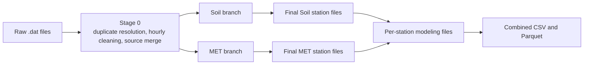
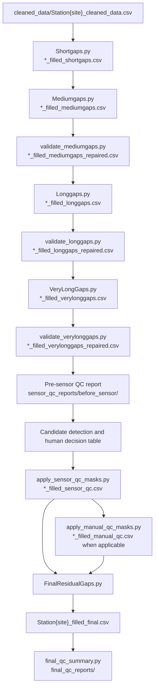
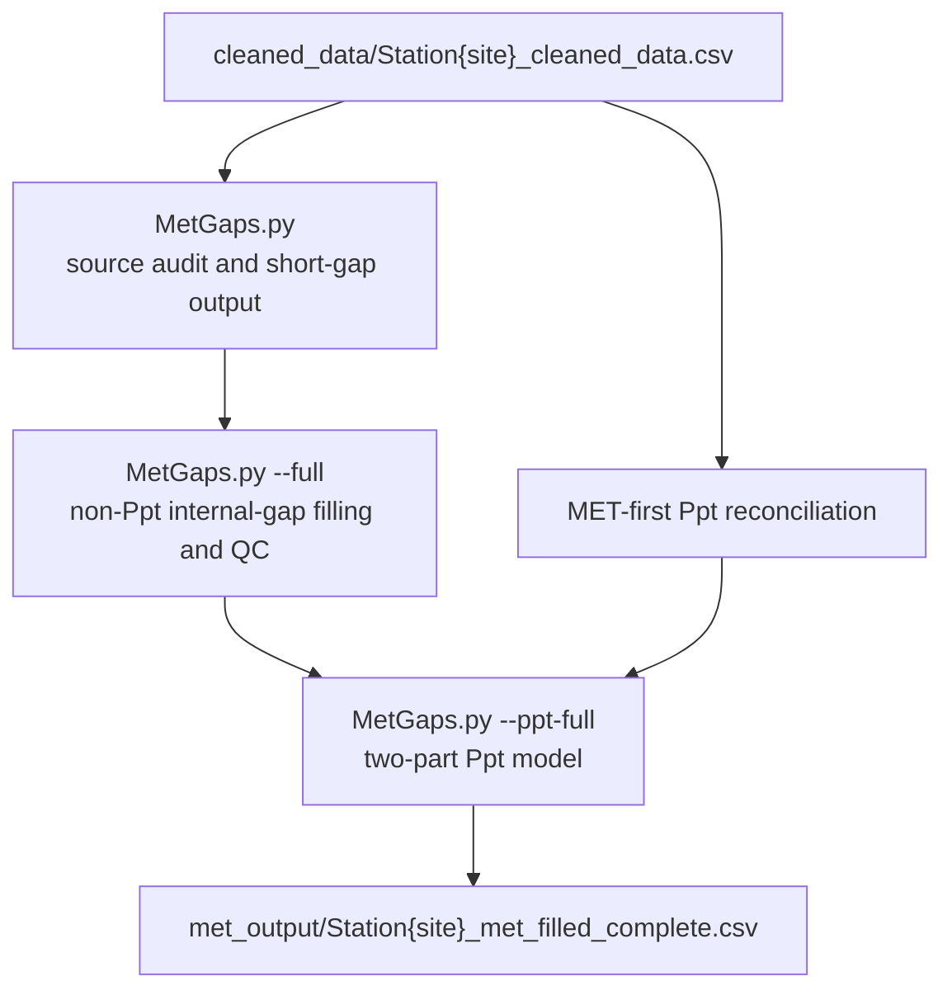

# TxSON 33-Station Technical Notes

## Zun Cao

This document describes the implementation and design choices behind the
TxSON33 cleaning and imputation workflow. For installation and normal commands,
start with [README.md](README.md).

## Contents

- [Released Dataset](#released-dataset)
- [Pipeline and File Flow](#pipeline-and-file-flow)
- [Inputs and Stage 0](#inputs-and-stage-0)
- [Soil Source Coverage](#soil-source-coverage)
- [Gap Classes and Prerequisites](#gap-classes-and-prerequisites)
- [Soil Filling](#soil-filling)
- [Soil Validation](#soil-validation)
- [Sensor and Manual QC](#sensor-and-manual-qc)
- [FinalResidual and Final Soil QC](#finalresidual-and-final-soil-qc)
- [MET Processing](#met-processing)
- [Precipitation](#precipitation)
- [Model Selection Evidence](#model-selection-evidence)
- [Final Dataset Construction](#final-dataset-construction)
- [Visualization](#visualization)
- [Provenance and Reports](#provenance-and-reports)
- [Known Limitations](#known-limitations)

## Released Dataset

The completed Soil + MET release is:

```text
modeling_data/txson33_authoritative_2026-09-07/
```

Its preferred modeling file is:

```text
TxSON33_modeling.parquet
```

The combined dataset contains 33 stations and 2,720,775 hourly rows. It has a
matching CSV, per-station CSV files, a data dictionary, station date ranges,
missingness summaries, observed/imputed summaries, cell-level imputation
records, and an unresolved-QC summary.

Final Soil output has no remaining gaps inside valid source coverage. The
269,064 Soil cells outside source coverage remain missing, as do the 12 absent
50-cm station-parameter combinations. Final `Ppt` is complete at all 33
stations. `Tair`, `RH`, `Srad`, `Wind speed`, and `Wind direction` are included
only where independent MET records provide source coverage.

## Pipeline and File Flow

### Overview



### Soil flow



Stations without rows in `manual_qc_masks.csv` go directly from the sensor-QC
file to FinalResidual. Every Soil model stage consumes its specific predecessor,
including the repaired file produced by each validator.

### MET flow



## Inputs and Stage 0

The default raw input is `datasets/TxSON_data_2026-02-24/`, containing 33 Soil
files and six dedicated MET files. `datacleaning.py` accepts both
`SM_1.dat`/`MET_1.dat` and `CB01.dat`/`CB01_met.dat` naming. It locates the real
header when citation text precedes the table and parses Campbell TOA5 MET files.

Stage 0 performs these operations in order:

1. Parse timestamps and standardize column names.
2. Resolve duplicate timestamps within each source.
3. Aggregate each resolved source to hourly observations.
4. Outer-join Soil and MET, retaining the union of their timestamps.
5. Build a complete hourly index over the combined start and end times.
6. Select valid `Ppt` using MET first and Soil second.
7. Replace out-of-range measurements with `NaN`.
8. Write data, gap, duplicate, and provenance reports.

### Duplicate timestamps

Duplicate resolution occurs before hourly aggregation and does not depend on
input row order:

- exact duplicate rows collapse to one row;
- complementary rows merge column by column when their non-null values agree;
- conflicting measurement values are recorded and the conflicting cell becomes
  `NaN`;
- a Flag-only conflict is recorded and the unresolved Flag becomes `NaN`, since
  no severity ordering is documented for the source flags.

The current raw files contain 94,976 duplicate timestamp groups: 94,873 exact
groups, no complementary groups, 63 measurement-conflict groups, and 40
Flag-only conflict groups. Stage 0 removes 178,546 excess rows. Any duplicate
timestamp that reaches a downstream stage is treated as an input error.

### Hourly aggregation

For sub-hourly input, `Ppt` is summed with at least one valid value required.
Other numeric measurements are averaged. Flag and other nonnumeric values use
the final value within the hour and are not numerically averaged. Invalid or
negative source precipitation is removed before summation so it cannot cancel
valid rain or block the alternate source.

### Soil/MET merge and Ppt precedence

The outer join preserves Soil-only and MET-only hours. At stations with a
dedicated MET file, valid MET `Ppt` is selected first and valid Soil-file `Ppt`
is used when MET is missing. `Ppt` stays missing at Stage 0 only when neither
source has a valid value. This source selection occurs after each source has
been duplicate-resolved and aggregated hourly.

### Physical ranges

| Parameter | Stage 0 range |
|---|---:|
| `SWC_*` | 0 to 0.6 m3/m3 |
| `T_*`, `Tair` | -30 to 60 C |
| `RH` | 0 to 100% |
| `Ppt`, `Srad` | >=0 |
| `Wind speed` | 0 to 25 m/s |
| `Wind direction` | 0 to 360 degrees |

### Stage 0 files

```text
cleaned_data/Station{site}_cleaned_data.csv
missing_data/Station{site}_missing_data.csv
raw_merged_data/raw_merged_station_{site}.csv
duplicate_resolution_reports/Station{site}_duplicate_summary.csv
duplicate_resolution_reports/Station{site}_duplicate_conflicts.csv
stage0_reports/Station{site}_provenance.json
```

`raw_merged_data` is an hourly source-resolved intermediate, not a copy of the
raw files. Each provenance JSON records source bounds and SHA-256 hashes for the
raw inputs, Stage 0 code, and generated outputs. The Stage 0 release has unique,
monotonic hourly timestamps for all 33 stations and 2,720,775 rows in total.

## Soil Source Coverage

`soil_source_coverage.py` defines one coverage rule shared by Short, Medium,
Long, VeryLong, their validators, FinalResidual, and final QC. For each Soil
parameter, coverage is the closed hourly interval from its first to last finite
value in the hash-verified Stage 0 file. Later fills and QC masks cannot extend
or erase that interval.

This parameter-specific rule separates internal gaps from hours added only by
MET coverage:

- internal `NaN` values are eligible for gap classification and filling;
- leading or trailing `NaN` values outside coverage remain missing;
- a source column with no valid observations has no fillable coverage;
- a source column that is absent is never synthesized.

Gap reports classify only internal missing periods. Final QC records outside-
coverage counts separately in `final_qc_soil_source_coverage.csv`, so they are
not reported as failed imputation.

In this release, 252 Soil station-parameter columns are present. The source
files for `CB07`, `CB26`, `FD03`, `FD18`, `FD21`, and `FD24` do not contain
`SWC_50` or `T_50`, leaving 12 unavailable combinations. The 269,064 protected
outside-coverage cells occur at CB04, CB06, FD02, FD03, and WC05.

## Gap Classes and Prerequisites

The four gap classes do not overlap:

| Class | Missing hours |
|---|---:|
| Short | `<24` |
| Medium | `24-167` |
| Long | `168-719` |
| VeryLong | `>=720` |

The missing-data inventory is intersected with source coverage before a class
is assigned. Short reads Stage 0, Medium reads Short, Long reads the repaired
Medium output, and VeryLong reads the repaired Long output. FinalResidual reads
the sensor-QC output, or the manual-QC output for a station with approved masks.
A missing prerequisite produces a clear error instead of substituting another
stage file.

## Soil Filling

The Soil branch processes four soil-moisture depths and four soil-temperature
depths:

```text
SWC_5, SWC_10, SWC_20, SWC_50
T_5, T_10, T_20, T_50
```

### Short

`Shortgaps.py` uses PCHIP interpolation for soil moisture and time
interpolation for soil temperature. Both neighboring observations must exist;
the stage does not extrapolate an edge gap.

### Medium

`Mediumgaps.py` fits daily-seasonal SARIMAX models using the seven days before
each gap. Soil moisture may use `Ppt`; soil temperature may use `Tair` and
`Srad`. Automatic order selection is followed by a residual check and, when
needed, one expanded search. The forecast is anchored toward observations at
the gap boundaries and clipped to the configured physical range.

Environmental drivers are evaluated separately for every model fit. A driver
is used only when all of its training and prediction values are present. An
incomplete driver is excluded rather than filled with zero. If no candidate
driver remains, the same SARIMA model is fitted without exogenous variables.
The detail log records one of four modes:

```text
complete_exogenous
partial_exogenous
univariate_missing_drivers
univariate_no_available_drivers
```

It also records available, used, and excluded drivers and their missing counts
in the training and prediction windows. A real observed `Ppt = 0` remains zero;
only missing values trigger exclusion.

### Long

`Longgaps.py` uses rolling XGBoost predictions with time features, recent target
history, and environmental summaries. Missing `Ppt`, `Tair`, and `Srad` stay as
`NaN`; they are not forward-filled, backward-filled, or converted to zero.
XGBoost handles these values through its native missing-value route.

When independent `Tair` has observations it is used directly. If independent
`Tair` is wholly unavailable, the existing mean-soil-temperature proxy is used
instead. This proxy choice is recorded as a driver source; it is not a zero
substitution.

### VeryLong

`VeryLongGaps.py` selects the donor with the largest eligible absolute
correlation for each station-parameter. Selection uses paired, finite values on
matching timestamps. One donor is selected for the station-parameter and reused
for all of its VeryLong gaps; selection is not repeated per gap.

When sufficient overlap exists, a linear mapping from donor to target is fitted.
Hours unavailable from that donor use the mean of eligible donor stations. The
chronological donor holdout uses the latest 10% of timestamp-aligned paired
observations, so target and donor series with different date ranges are never
compared by raw array position.

## Soil Validation

Medium, Long, and VeryLong each write a candidate output and then run a separate
validator. The checks include missing predictions, physical limits, boundary
connections, and excessive hourly changes. Rejected Medium and Long fills are
restored to missing before the next stage. VeryLong validation can repair
individual points within an otherwise useful long segment.

The completed rebuild produced:

| Validator result | Count |
|---|---:|
| Medium accepted segments | 886 |
| Medium rejected segments | 41 |
| Medium skipped segments | 97 |
| Long accepted segments | 252 |
| Long rejected segments | 6 |
| VeryLong accepted segments | 151 |
| VeryLong review segments | 93 |
| VeryLong repaired segments | 19 |
| VeryLong repaired points | 63,855 |

Segment-level details remain in the validation CSVs. A review label records the
reason for caution; repair and later FinalResidual processing determine the
values that reach the final Soil files.

## Sensor and Manual QC

### Whole-sensor review

`sensor_qc_decisions.py` scans the repaired VeryLong data and creates candidate
records for patterns such as near-zero dominance, low variability, and long
constant runs. Candidate status alone never authorizes masking.

`sensor_qc_review_decisions.csv` is the version-controlled human decision table.
An `approved` or `rejected` decision requires station, parameter, reviewer,
review date, and reason. It contains eight completed rejection decisions. When
combined with the generated candidate report, the current review state is:

| Decision | Sensors |
|---|---|
| `rejected` | WC05 `SWC_20`, WC05 `SWC_50`, FD11 `SWC_10`, FD22 `SWC_5`, FD22 `SWC_20`, FD22 `SWC_50`, FD16 `SWC_5`, FD08 `SWC_5` |
| `pending` | CB15 `SWC_10` |
| `approved` | None |

`rejected` means that whole-column masking was rejected, not that every value
from the sensor was certified. `apply_sensor_qc_masks.py` therefore masked no
whole sensor in this rebuild. `CB15 SWC_10` remains unmasked and is the sole
pending sensor-QC item.

Candidate detection reads the dedicated pre-sensor report under
`sensor_qc_reports/before_sensor/`. A normal final QC run reports pending
candidates without changing their status.

### Manual interval and point QC

`manual_qc_masks.csv` contains 33 reviewed rules across seven stations. They
cover full or partial low-confidence sensor periods, two confirmed sensor
freezes, and individually reviewed spikes. The completed run masked 228,387
values before FinalResidual.

Each rule has an inclusive start and end. Individual points use the same
timestamp for both fields. `apply_manual_qc_masks.py` changes only those
timestamps, and `FinalResidualGaps.py` splits a larger missing run at override
boundaries so that a requested refill method cannot spread beyond its approved
interval.

The main reviewed periods are:

```text
CB15 SWC_5: full source-supported history
CB15 T_10: 2019-12-03 13:00
CB19 SWC_5 and SWC_10: 2019-07-01 through 2022-10-31
CB20 SWC_5: 2017-01-01 through 2022-11-30
CB20 SWC_50: 2017-01-15 through 2023-03-22; donor-mean refill
WC05 SWC_50: 2021-08-12 12:00 through 2023-06-12 00:00
FD22 SWC_50: 2021-08-04 10:00 through 2022-11-21 03:00
FD22 SWC_5: 18 reviewed points during 2023-11-05 to 2023-11-09
FD16 SWC_5: 2 reviewed points in October 2021
FD08 SWC_5: 5 reviewed points from July to September 2022
```

The CSV is the exact source for all timestamps and decision reasons.

## FinalResidual and Final Soil QC

`FinalResidualGaps.py` fills remaining eligible internal Soil values after
validation and QC. Its fallback order is:

1. linear donor regression when target/donor overlap is sufficient;
2. donor mean when the selected donor is unavailable at a timestamp;
3. donor mean without target training for an explicitly masked sensor period;
4. donor day-of-year/hour climatology when no donor has the same timestamp.

The stage retains method, donor, correlation, overlap, refill override, and
boundary-adjustment information in each station's detail file. Source-observed
values outside the approved masks are not changed. Source coverage is checked
again before writing, so FinalResidual cannot fill a MET-only boundary or an
absent Soil sensor.

Final Soil QC reports:

```text
final_qc_reports/final_qc_overview.csv
final_qc_reports/final_qc_station_parameter_summary.csv
final_qc_reports/final_qc_soil_source_coverage.csv
final_qc_reports/final_qc_missing_sensor_columns.csv
final_qc_reports/final_qc_remaining_nan_runs.csv
final_qc_reports/final_qc_suspicious_sensors.csv
final_qc_reports/final_qc_sensor_candidate_status.csv
final_qc_reports/final_qc_review_closure_summary.csv
```

All source-present Soil parameters have zero remaining internal missing hours.
The reports keep outside-coverage `NaN` values and missing source columns in
separate categories and list the pending `CB15 SWC_10` candidate.

## MET Processing

Dedicated non-Ppt MET observations exist at:

```text
CB01, CB04, CB06, FD02, FD03, WC05
```

`MetGaps.py` processes `Tair`, `RH`, `Srad`, `Wind speed`, and `Wind direction`
at those stations. It fills internal gaps within retained post-QC coverage;
leading and trailing periods are not extrapolated. Gap runs are split by actual
timestamp adjacency, so missing observations separated by more than one hour
cannot be grouped just because they are adjacent in a filtered array.

The current method map is:

| Parameter | Short | Medium | Long | VeryLong |
|---|---|---|---|---|
| `Tair` | Donor regression | Donor regression | Donor regression | Donor regression |
| `RH` | Linear | XGBoost | Donor regression | Donor regression |
| `Srad` | Donor regression | Random Forest | XGBoost | Donor regression |
| `Wind speed` | XGBoost | XGBoost | XGBoost | Donor regression |
| `Wind direction` | Random Forest | Random Forest | Random Forest | XGBoost |

The completed full MET stage filled 52,064 internal non-Ppt hours and reported
no failed segments. Model and repair details are under
`met_qc_reports/model_fill/`. Stations without dedicated MET files retain
structurally unavailable non-Ppt MET columns in the combined schema.

## Precipitation

Six stations have `Ppt` in both the Soil and dedicated-MET sources. The source
order is:

1. valid dedicated-MET `Ppt`;
2. valid same-station Soil-file `Ppt` when MET is missing;
3. missing when neither direct source is available;
4. model filling only after source reconciliation.

For the other 27 stations, Soil-file `Ppt` is the direct observed source. The
model never overwrites a retained direct observation.

Missing precipitation is modeled in two parts. A Random Forest first estimates
rain occurrence, and a second Random Forest estimates positive amount.
Features include hour/day-of-year cycles and robust concurrent donor-network
aggregates. The occurrence threshold is selected per station from out-of-bag
predictions using CSI, with 0.5 as the fallback.

In the completed rebuild, the model filled 296,766 source-missing hours, left
zero `Ppt` values missing, and changed zero retained direct observations. A
genuine observed zero remains zero throughout source reconciliation and model
preparation.

## Model Selection Evidence

The notebooks in this directory evaluate candidate methods by hiding observed
segments and scoring predictions against the known values:

| Notebook | Purpose |
|---|---|
| `Gap_Filling_Model_Comparison.ipynb` | MET method comparison and error matrices |
| `MET_Model_Robustness.ipynb` | Multi-seed, seasonal, station-level, and deployment-length checks for non-Ppt MET methods |
| `Soil_Gap_Filling_Model_Comparison.ipynb` | Soil method comparison, robustness summaries, and publication figures |
| `MET_QC_Review.ipynb` | Visual review of flagged MET segments |

The production Soil method map remains Short interpolation, Medium SARIMAX,
Long XGBoost, and VeryLong donor regression. The MET map is listed above.
Independent confirmation and production-adapter checks did not support a final
method change.

The saved artificial-gap benchmark samples were created before some of the
final sensor-review decisions. They remain useful method-development evidence,
but their numerical scores should not be presented as a validation of the final
QC decision set without rerunning the benchmark. Benchmark notebooks do not
modify station delivery files.

## Final Dataset Construction

The completed release combines the final Soil and complete MET products on
their station timelines. The combined table contains:

```text
Station, Timestamp
SWC_5, SWC_10, SWC_20, SWC_50
T_5, T_10, T_20, T_50
Tair, RH, Srad, Wind speed, Wind direction, Ppt
Any_Soil_Imputed, Any_MET_Imputed
```

`Any_Soil_Imputed` and `Any_MET_Imputed` are row-level indicators: they show
that at least one value from that branch was absent at Stage 0 and present in
the final output. They do not identify a specific imputed column. Cell-level
records are stored in `imputation_provenance.csv`.

The release files are:

```text
modeling_data/txson33_authoritative_2026-09-07/TxSON33_modeling.parquet
modeling_data/txson33_authoritative_2026-09-07/TxSON33_modeling.csv
modeling_data/txson33_authoritative_2026-09-07/per_station/Station{site}_modeling.csv
```

Use the Parquet file for analysis because it is smaller and preserves data
types more reliably than the combined CSV.

## Visualization

`data_visualization/Dynamic_Data_Visualization_TxSON33.ipynb` reads the final
per-station modeling files directly from:

```text
modeling_data/txson33_authoritative_2026-09-07/per_station/
```

The notebook parses `Timestamp` as the unique monotonic datetime index and
displays the dataset version, station, parameter, and selected period. It does
not merge intermediate Soil and MET files or fall back to `cleaned_data`,
Short, Medium, Long, VeryLong, or older MET outputs. An absent 50-cm sensor or
structurally unavailable MET variable is shown as unavailable rather than
causing a plotting failure.

## Provenance and Reports

The main files for tracing a release are:

```text
stage0_reports/Station{site}_provenance.json
duplicate_resolution_reports/Station{site}_duplicate_summary.csv
duplicate_resolution_reports/Station{site}_duplicate_conflicts.csv
output/Station{site}_shortgap_fill_detail.csv
output/Station{site}_mediumgap_fill_detail_repaired.csv
output/Station{site}_longgap_fill_detail_repaired.csv
output/Station{site}_verylonggap_fill_detail_repaired.csv
output/Station{site}_final_residual_fill_detail.csv
mediumgaps_validation_summary.csv
longgaps_validation_summary.csv
verylonggaps_validation_summary.csv
sensor_qc_review_decisions.csv
manual_qc_masks.csv
soil_qc_review_decisions.csv
met_qc_review_decisions.csv
met_qc_reports/model_fill/met_model_fill_segment_detail.csv
met_qc_reports/ppt_model_fill/ppt_model_fill_segment_detail.csv
modeling_data/txson33_authoritative_2026-09-07/imputation_provenance.csv
```

Generated station files and detailed reports are large local artifacts. The
scripts, notebooks, configuration, documentation, and compact decision tables
are the reproducible project sources.

## Known Limitations

- Six stations lack both 50-cm Soil columns, giving 12 unavailable
  station-parameter combinations.
- Soil filling is limited to parameter-specific source coverage. The 269,064
  outside-coverage cells are intentional missing values, not failed fills.
- Non-Ppt MET variables exist only at the six dedicated-MET stations and are
  not extrapolated beyond retained post-QC coverage.
- `CB15 SWC_10` remains pending for whole-sensor QC. It is unmasked in the
  release and is reported explicitly.
- VeryLong donor selection is global to each station-parameter, based on all
  paired finite timestamps available in the stage input. It is designed for
  retrospective reconstruction and is not a causal, per-gap donor procedure.
- Model-comparison seasons are midpoint strata rather than independent yearly
  holdout folds. The saved benchmark scores also predate some final QC decisions.
- Independent external precipitation validation requires a verified coordinate
  table for the 33 site codes, which is not included in this repository.
- The source unit metadata for `Srad` and `Wind speed` is not standardized in
  the final data dictionary; analyses should confirm units from the raw station
  metadata before interpretation.
