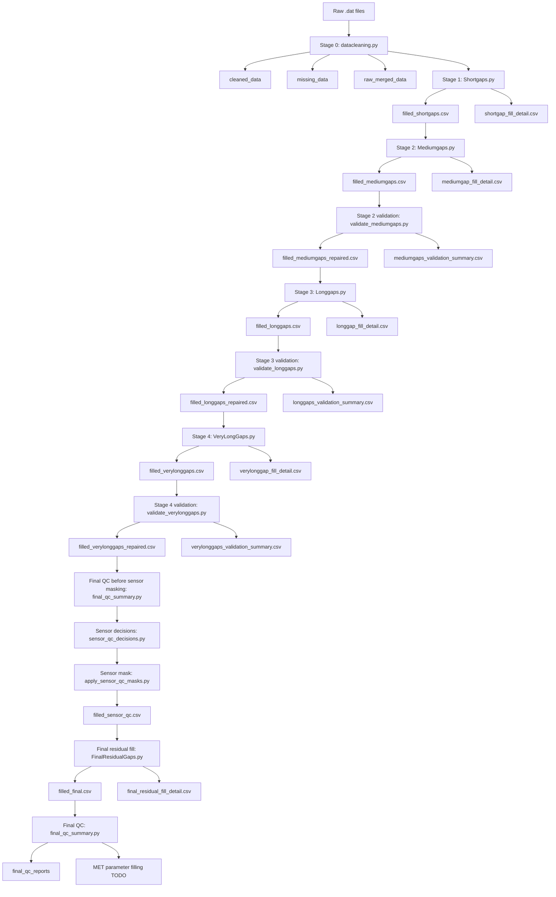

# TxSON 33-Station Cleanup: Completed Work

## Zun Cao

This note documents only the completed and verified work for the new 33-station dataset:

```text
datasets/TxSON_data_2026-02-24/
```

## Contents

- [Recommended Recipe](#recommended-recipe)
- [Current Pipeline Map](#current-pipeline-map)
- [Missing Sensor Columns](#missing-sensor-columns)
- [Stage 0: Data Cleaning](#stage-0-data-cleaning)
- [Short-Gap Filling](#short-gap-filling)
- [Medium-Gap Filling](#medium-gap-filling)
- [Medium-Gap Validation And Repair](#medium-gap-validation-and-repair)
- [Long-Gap Filling](#long-gap-filling)
- [Long-Gap Validation And Repair](#long-gap-validation-and-repair)
- [Very-Long-Gap Filling And Validation](#very-long-gap-filling-and-validation)
- [Final QC Summary](#final-qc-summary)
- [Sensor-Level Data Quality Notes](#sensor-level-data-quality-notes)
- [Final Residual Filling](#final-residual-filling)
- [Validation Outputs](#validation-outputs)
- [Visualizations](#visualizations)
- [Dynamic Notebook](#dynamic-notebook)
- [Remaining Work](#remaining-work)

## Recommended Recipe

Use `imputation_pipeline.py` as the main entry point. The individual scripts are
still available for debugging, but users should not need to remember the full
manual sequence.

Run the complete soil moisture and soil temperature workflow:

```powershell
cd data-cleanup/imputation_pipeline
python imputation_pipeline.py --stage all
```

Preview the commands and stale-output cleanup without running anything:

```powershell
python imputation_pipeline.py --stage all --dry-run
```

Run only a later section of the workflow:

```powershell
python imputation_pipeline.py --stage qc
python imputation_pipeline.py --stage final
```

Run selected stations:

```powershell
python imputation_pipeline.py --stage final --station CB01 FD08
```

The runner removes stale generated outputs for the selected stage range before
running. This prevents old downstream files such as `filled_final.csv` from
being accidentally reused by QC scripts. When `--station` is supplied, cleanup
is limited to those station output files plus global report folders.

## Current Pipeline Map



Current scope:

- The staged gap filling currently focuses on soil moisture and soil temperature:

```text
SWC_5, SWC_10, SWC_20, SWC_50,
T_5, T_10, T_20, T_50
```

- Other parameters still need separate filling or quality-control methods:

```text
Ppt, Tair, RH, Srad, Wind speed, Wind direction
```

- `Flag` should not be model-filled as a physical variable.

## Missing Sensor Columns

Some stations do not include all soil-depth columns in the source data. These
are treated as unavailable sensors, not as gaps to be imputed. The imputation
scripts skip missing columns and do not create synthetic full sensor columns.

Stations currently missing `SWC_50` and `T_50`:

```text
CB07, CB26, FD03, FD18, FD21, FD24
```

Status summary:

```text
Stage 0 cleaning:              completed for 33 stations
Short gaps:                    completed for 33 stations
Medium gaps:                   completed and validated/repaired
Long gaps:                     completed and validated/repaired
Very long gaps:                completed and validated/repaired
Sensor-level anomaly handling: completed for current bad-sensor candidates
Final residual filling:        completed for soil moisture/temperature
Final soil NaN remaining:      0
MET parameter filling:         TODO
Pipeline runner/recipe:        completed
```

## Stage 0: Data Cleaning

Script:

```text
data-cleanup/imputation_pipeline/datacleaning.py
```

What it now supports:

- New station IDs such as `CB01`, `FD08`, `WC05`
- Old station IDs such as `1`, `2`, ..., `6`
- New soil files named `{site}.dat`
- New MET files named `{site}_met.dat`
- Old files named `SM_{id}.dat` and `MET_{id}.dat`
- Soil files with citation/header text before the `Date` row
- Campbell TOA5 MET files
- Stations with no MET file
- Duplicate timestamps
- Sub-hourly records, aggregated to hourly data

Important cleaning logic:

- Final output is reindexed to a complete hourly timeline.
- Invalid physical values are replaced with `NaN`.
- Missing summaries are generated from the full hourly timeline.
- Short missing summaries with no rows still keep the standard CSV header.

Run one station:

```powershell
cd data-cleanup/imputation_pipeline

python datacleaning.py --station CB01 `
  --soil-base-dir ../../datasets/TxSON_data_2026-02-24 `
  --met-base-dir ../../datasets/TxSON_data_2026-02-24
```

Main outputs:

```text
cleaned_data/StationCB01_cleaned_data.csv
missing_data/StationCB01_missing_data.csv
raw_merged_data/raw_merged_station_CB01.csv
```

## Short-Gap Filling

Script:

```text
data-cleanup/imputation_pipeline/Shortgaps.py
```

What it now supports:

- Site-code station IDs such as `CB01`
- Auto-discovery of `Station{site}_cleaned_data.csv`
- Missing columns are skipped safely

Short-gap rules:

- Gaps shorter than 24 hours are filled.
- `SWC_*` uses PCHIP interpolation.
- `T_*` and `Tair` use time interpolation.
- `Ppt` short gaps are filled with `0`.
- `Wind direction` uses vector interpolation.

Run all discovered 33 stations:

```powershell
cd data-cleanup/imputation_pipeline

$sites = Get-ChildItem ..\..\datasets\TxSON_data_2026-02-24 -Filter *.dat |
  Where-Object { $_.Name -notlike '*_met.dat' } |
  Sort-Object BaseName |
  ForEach-Object { $_.BaseName }

python Shortgaps.py --station $sites
```

Main outputs:

```text
output/StationCB01_filled_shortgaps.csv
output/StationCB01_shortgap_fill_detail.csv
```

Stations with no short gaps still get a `filled_shortgaps.csv` file.

## Medium-Gap Filling

Script:

```text
data-cleanup/imputation_pipeline/Mediumgaps.py
```

Current status:

- Updated for the 33-station site-code dataset.
- Supports station IDs such as `CB01`, `FD08`, and `WC05`.
- Supports old numeric station IDs if matching staged files exist.
- Can run all discovered stations, selected stations, all soil parameters, or selected parameters.
- Tested on selected stations before full batch execution.

Medium-gap definition:

- Gaps with `Number Missing >= 24` and `Number Missing <= 168` are treated as medium gaps.
- The script reads gap windows from `missing_data/Station{site}_missing_data.csv`.
- The script fills only variables listed in `param_config.ALL_SOIL_PARAMS`, unless `--param` is supplied.
- The current soil parameters are:

```text
SWC_5, SWC_10, SWC_20, SWC_50,
T_5, T_10, T_20, T_50
```

Input files:

```text
output/Station{site}_filled_shortgaps.csv
missing_data/Station{site}_missing_data.csv
```

Main model:

- Each medium gap is filled independently for one station and one parameter.
- The model uses the 7 days before the gap as the local training window.
- Training data are regularized to an hourly index.
- Remaining NaNs inside the training window are locally interpolated or forward/back filled.
- If fewer than 24 observed training hours are available, that gap is skipped.
- `auto_arima` selects a SARIMA order with daily seasonality (`m=24`).
- The selected order is then fit with `statsmodels` SARIMAX.
- If residual autocorrelation remains at lag 24, the script retries with a slightly larger model search space.
- If SARIMAX fails for a gap, the script skips that gap and continues with the rest of the station.

Exogenous variables:

- Preferred exogenous columns are configured in `param_config.py`.
- The script uses only preferred columns that exist in the station file and contain at least some non-missing data.
- Missing exogenous values are filled with `0` after reindexing.
- If no usable exogenous columns exist, SARIMAX runs without exogenous predictors.

Post-processing:

- Forecasts are linearly anchored to the real observations immediately before and after the gap when both boundary values exist.
- This boundary correction prevents medium-gap forecasts from creating sharp jumps at the start or end of a missing period.
- Soil moisture forecasts are clipped to `0 <= SWC <= 0.6`.
- Soil temperature forecasts are clipped to `-30 <= T <= 60`.

Run examples:

```powershell
cd data-cleanup/imputation_pipeline

# One station, one parameter
python Mediumgaps.py --station CB01 --param SWC_50

# One station, all soil moisture/temperature parameters
python Mediumgaps.py --station CB19

# All discovered stations and default soil parameters
python Mediumgaps.py
```

Main outputs:

```text
output/StationCB01_filled_mediumgaps.csv
output/StationCB01_mediumgap_fill_detail.csv
```

The detail file records every filled timestamp, including:

```text
Station, Parameter, Start, End, Timestamp, Filled
```

Validation notes:

- Check that NaN counts decrease only for medium-gap timestamps.
- Check that no SWC or soil temperature values exceed the physical bounds.
- Check gap boundaries in the dynamic notebook to confirm that filled values connect smoothly to the surrounding observations.
- Red missing-timestamp markers in the notebook still show where the original data were missing, even after values have been filled.

## Medium-Gap Validation and Repair

Script:

```text
data-cleanup/imputation_pipeline/validate_mediumgaps.py
```

Purpose:

- Audit the SARIMAX medium-gap outputs without rerunning the slow model.
- Keep good medium-gap fills.
- Reject suspicious medium-gap fills by restoring those timestamps to `NaN`.
- Preserve the original `filled_mediumgaps.csv` files as the raw SARIMAX outputs.
- Write repaired files for downstream use.

Default validation rules:

- Reject a whole filled gap segment if any filled value hits the hard clipping bounds:

```text
SWC_*: 0 or 0.6
T_*:   -30 or 60
```

- Reject a whole filled gap segment if the internal hourly jump is too large.
- Reject a whole filled gap segment if the boundary jump to real surrounding observations is too large.
- Reject soil-temperature segments that move far outside the local observed temperature context.
- Leave skipped gaps as `NaN`; these are usually gaps with fewer than 24 observed training hours before the missing period.

Run validation only:

```powershell
cd data-cleanup/imputation_pipeline
python validate_mediumgaps.py
```

Run validation and write repaired station files:

```powershell
python validate_mediumgaps.py --write-repaired
```

Validation outputs:

```text
mediumgaps_validation_summary.csv
mediumgaps_rejected_segments.csv
mediumgaps_validation_station_summary.csv
output/StationCB01_filled_mediumgaps_repaired.csv
output/StationCB01_mediumgap_fill_detail_repaired.csv
```

Validation summary fields:

```text
Station                 site code
Parameter               soil variable being checked
Start / End             original missing-gap window
Expected Hours          number of missing hourly values in the gap summary
Filled Hours            number of values written by Mediumgaps.py
Filled Min / Filled Max range of the model-filled values
Lower/Upper Bound Hits  number of filled values at the hard physical clipping bounds
Max Hourly Change       largest absolute hour-to-hour change inside the filled segment
Start/End Boundary Jump absolute jump between the fill and surrounding real observations
Context Min / Max       nearby observed temperature range used for soil-temperature checks
Status                  accepted, rejected, or skipped
Reason                  validation rule that triggered the status
Training Observed Hours observed hours available before skipped gaps
```

Status meanings:

```text
accepted  fill is kept in *_filled_mediumgaps_repaired.csv
rejected  fill is considered suspicious and restored to NaN in the repaired file
skipped   Mediumgaps.py did not fill it, usually because training data were insufficient
```

Current full-batch validation result:

```text
accepted: 877 segments, 53,461 hours
rejected: 50 segments, 3,239 hours restored to NaN
skipped: 97 segments, 6,266 hours left as NaN
```

The repaired files should be used as the safer input to the next gap-filling stage.

## Long-Gap Filling: Initial 33-Station Adaptation

Script:

```text
data-cleanup/imputation_pipeline/Longgaps.py
```

Current status:

- Updated to support site-code station IDs such as `CB01` and `FD24`.
- Uses `output/Station{site}_filled_mediumgaps_repaired.csv` as the preferred input.
- Falls back to raw `filled_mediumgaps.csv` only if the repaired file is unavailable.
- Missing columns are skipped safely; for example, stations without `SWC_50` or `T_50` do not crash.
- The old `ref_station = 3` dependency was removed.
- Driver columns are created locally from available data:

```text
Ppt         filled with 0 when missing
Tair_model  uses Tair when available, otherwise the mean of available soil temperature depths
Srad_model  uses Srad when available, otherwise 0
```

Long-gap definition:

```text
Number Missing >= 168 and <= 720 hours
```

Initial tests completed:

```text
CB01 --param SWC_50
CB01 all default soil parameters
FD24 --param SWC_10
```

These tests produced structurally valid long-gap outputs with stable hourly indexes, expected fill counts, no physical-bound violations, and smooth boundary connections. Full 33-station long-gap batch validation has not been completed yet.

## Long-Gap Validation and Repair

Script:

```text
data-cleanup/imputation_pipeline/validate_longgaps.py
```

Purpose:

- Audit the XGBoost long-gap outputs without rerunning the model.
- Keep accepted long-gap fills.
- Reject suspicious filled long-gap segments by restoring those timestamps to `NaN`.
- Preserve the original `filled_longgaps.csv` files as raw XGBoost outputs.
- Write repaired long-gap files for downstream use.

Run validation only:

```powershell
cd data-cleanup/imputation_pipeline
python validate_longgaps.py
```

Run validation and write repaired station files:

```powershell
python validate_longgaps.py --write-repaired
```

Validation outputs:

```text
longgaps_validation_summary.csv
longgaps_rejected_segments.csv
longgaps_validation_station_summary.csv
output/StationCB01_filled_longgaps_repaired.csv
output/StationCB01_longgap_fill_detail_repaired.csv
```

Current full-batch validation result:

```text
accepted: 257 segments, 97,588 hours
rejected: 1 segment, 611 hours restored to NaN
```

The only rejected long-gap segment in the current run is:

```text
FD16 SWC_5, 2024-10-02 09:00 to 2024-10-27 19:00
Reason: hit_physical_bound
```

The repaired long-gap files should be used as the safer input to the very-long-gap stage.

## Very-Long-Gap Filling and Validation

Script:

```text
data-cleanup/imputation_pipeline/VeryLongGaps.py
```

Current status:

- Updated to support site-code station IDs such as `CB01`, `CB10`, and `FD08`.
- Uses `output/Station{site}_filled_longgaps_repaired.csv` as the preferred input.
- Falls back to earlier staged outputs only if the repaired long-gap file is unavailable.
- Donor stations are discovered automatically from available staged outputs.
- Missing columns are skipped safely.

Very-long-gap definition:

```text
Number Missing >= 720 hours
```

Model idea:

- For each station, parameter, and very-long gap, choose a donor station with enough overlapping non-missing data.
- The donor is selected by highest absolute correlation with the target station for the same parameter.
- A linear regression maps donor values to target values:

```text
target_parameter ~= a * donor_parameter + b
```

- If no regression donor is available, the script falls back to the hourly mean of usable donor stations.
- Filled values are clipped to basic physical bounds.
- Boundary correction is applied so the fill connects to surrounding observations when available.

Initial tests completed:

```text
CB01 --param SWC_50
CB01 all default soil parameters
CB10 --param SWC_5
```

The full 33-station very-long-gap batch has been run.

Very-long-gap validation script:

```text
data-cleanup/imputation_pipeline/validate_verylonggaps.py
```

Run validation and write repaired station files:

```powershell
python validate_verylonggaps.py --write-repaired
```

Unlike the medium- and long-gap validators, the very-long-gap validator repairs
only clearly suspicious filled timestamps instead of rejecting an entire
months- or years-long segment. This avoids discarding a mostly useful long
fill because of a small number of bad points.

Current full-batch validation result:

```text
accepted: 163 segments
review:   82 segments
repaired: 18 segments
repaired points restored to NaN: 56,948
```

Main repaired issue:

```text
Some very-long SWC fills were clipped to the physical lower bound 0.
Those exact-bound filled timestamps were restored to NaN in the repaired files.
```

Main outputs:

```text
output/Station{site}_filled_verylonggaps.csv
output/Station{site}_filled_verylonggaps_repaired.csv
output/Station{site}_verylonggap_fill_detail.csv
output/Station{site}_verylonggap_fill_detail_repaired.csv
verylonggaps_validation_summary.csv
verylonggaps_review_segments.csv
verylonggaps_repaired_points.csv
verylonggaps_validation_station_summary.csv
```

## Final QC Summary

Script:

```text
data-cleanup/imputation_pipeline/final_qc_summary.py
```

This script audits the latest repaired station files. It does not modify the
data. It summarizes the remaining issues that need final decisions before the
dataset can be delivered.

Run:

```powershell
python final_qc_summary.py
```

Current summary after final residual filling:

```text
stations audited: 33
remaining NaN runs: 0
remaining NaN hours: 0
missing sensor columns: 12
suspicious station/parameter rows: 9
```

The `833,715` NaN hours seen after sensor-level QC masking were resolved by
the final residual filling stage. The 12 missing sensor columns are true
unavailable columns, not fillable gaps.

Final residual detail methods:

```text
donor_mean_no_target_training:           777,195 rows
linear_donor:                             43,905 rows
donor_mean_missing_linear_donor:          11,867 rows
donor_climatology_no_timestamp_donor:        748 rows
```

Current final-QC output files:

```text
final_qc_reports/final_qc_overview.csv
final_qc_reports/final_qc_station_parameter_summary.csv
final_qc_reports/final_qc_remaining_nan_runs.csv
final_qc_reports/final_qc_missing_sensor_columns.csv
final_qc_reports/final_qc_suspicious_sensors.csv
final_qc_reports/final_qc_verylong_review_summary.csv
```

## Sensor-Level Data Quality Notes

Some abnormal sensors are not caused by gap filling and should be tracked separately.

Sensor-level QC decision script:

```text
data-cleanup/imputation_pipeline/sensor_qc_decisions.py
```

Run:

```powershell
python sensor_qc_decisions.py
```

Current outputs:

```text
sensor_qc_reports/sensor_qc_decisions.csv
sensor_qc_reports/sensor_qc_action_summary.csv
```

Current sensor-level decision summary:

```text
bad_sensor_candidate:             9 rows
localized_bound_values_review:    3 rows
long_constant_review:             1 row
partial_or_bad_sensor_review:     1 row
```

Bad sensor candidates currently identified:

```text
WC05 SWC_20, WC05 SWC_50
CB15 SWC_10
FD11 SWC_10
FD22 SWC_5, FD22 SWC_20, FD22 SWC_50
FD16 SWC_5
FD08 SWC_5
```

These rows are candidates for exclusion before final residual filling because
the existing values are dominated by near-zero readings, long constant runs,
or very low variability.

Sensor-level QC mask script:

```text
data-cleanup/imputation_pipeline/apply_sensor_qc_masks.py
```

Run:

```powershell
python apply_sensor_qc_masks.py --write
```

This writes a non-destructive sensor-QC stage:

```text
output/Station{site}_filled_sensor_qc.csv
```

Current mask result:

```text
stations processed: 33
newly masked hours: 766,651
```

The original very-long-gap repaired files remain available.

## Final Residual Filling

Script:

```text
data-cleanup/imputation_pipeline/FinalResidualGaps.py
```

Run:

```powershell
python FinalResidualGaps.py
```

This fills the remaining soil moisture and soil temperature NaNs after
validation and sensor-level QC. It writes a non-destructive final stage:

```text
output/Station{site}_filled_final.csv
output/Station{site}_final_residual_fill_detail.csv
```

Method priority:

```text
1. linear donor regression, when enough target/donor overlap exists
2. donor mean for timestamps where the selected linear donor is missing
3. donor mean without target training for fully masked bad-sensor columns
4. donor day-of-year/hour climatology when no same-timestamp donor exists
```

Current result:

```text
33/33 final station files written
soil moisture and soil temperature NaN remaining: 0
physical bound violations: 0
```

The largest low-confidence portion is from `donor_mean_no_target_training`,
which is expected for full bad-sensor columns that were masked before final
filling.

Current items to keep under review:

```text
WC05 SWC_20 and SWC_50 are unrealistically low and nearly flat from the cleaned/raw stage.
This is not caused by Longgaps.py because WC05 has no long-gap detail output.
These columns should be handled by a sensor-quality rule before final delivery.

Additional suspicious sensor rows are listed in
final_qc_reports/final_qc_suspicious_sensors.csv.
These include near-zero or low-variability SWC columns such as CB15 SWC_10,
FD11 SWC_10, FD22 SWC_20/SWC_50, FD16 SWC_5, and FD08 SWC_5.
```

## Validation Outputs

Generated validation files:

```text
data-cleanup/imputation_pipeline/stage0_summary.csv
data-cleanup/imputation_pipeline/shortgaps_summary.csv
```

Validation checks completed:

- 33/33 stations produced cleaned files.
- 33/33 stations produced missing summary files.
- 33/33 stations produced raw merged files.
- 33/33 stations produced short-gap output files.
- No duplicate datetime indexes.
- No non-hourly steps after cleaning.
- No shape mismatch after short-gap filling.
- NaN counts decreased or stayed unchanged after short-gap filling.

## Visualizations

Generated overview script:

```text
data_visualization/visualize_txson_33_gaps.py
```

Generated reports:

```text
data_visualization/txson_33_gap_reports/txson_33_gap_overview.html
data_visualization/txson_33_gap_reports/txson_33_gap_details.csv
data_visualization/txson_33_gap_reports/txson_33_station_missing_metadata.csv
```

Generate or refresh reports:

```powershell
python data_visualization\visualize_txson_33_gaps.py
```

Generate a station-level missing timeline:

```powershell
python data_visualization\visualize_txson_33_gaps.py --station CB01
```

Example output:

```text
data_visualization/txson_33_gap_reports/txson_CB01_missing_timeline.html
```

## Dynamic Notebook

New notebook for the 33-station data:

```text
data_visualization/Dynamic_Data_Visualization_TxSON33.ipynb
```

Supporting module:

```text
data_visualization/txson33_dynamic_visualization.py
```

Controls:

```text
Plot Type
Station
Year
Month
MET Var
Time Type
```

Data source priority:

```text
output/Station{site}_filled_final.csv
output/Station{site}_filled_sensor_qc.csv
output/Station{site}_filled_verylonggaps_repaired.csv
output/Station{site}_filled_verylonggaps.csv
output/Station{site}_filled_longgaps_repaired.csv
output/Station{site}_filled_longgaps.csv
output/Station{site}_filled_mediumgaps_repaired.csv
output/Station{site}_filled_mediumgaps.csv
output/Station{site}_filled_shortgaps.csv
cleaned_data/Station{site}_cleaned_data.csv
```

Notebook behavior:

- Station list is discovered automatically.
- Year options update by station.
- Month options update by station and year.
- Plotly lines break at `NaN` gaps.
- Missing timestamps are marked in red.

## Remaining Work

The following items still need to be completed before final delivery:

```text
Review very-long-gap segments marked as review
Review the 9 remaining suspicious sensor rows in final_qc_suspicious_sensors.csv
Design filling/quality-control methods for MET parameters
```
